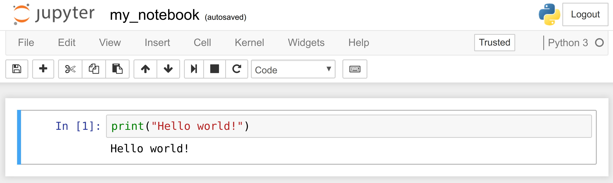
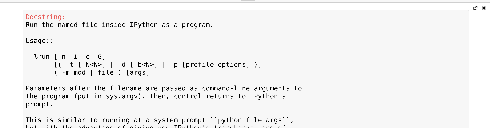
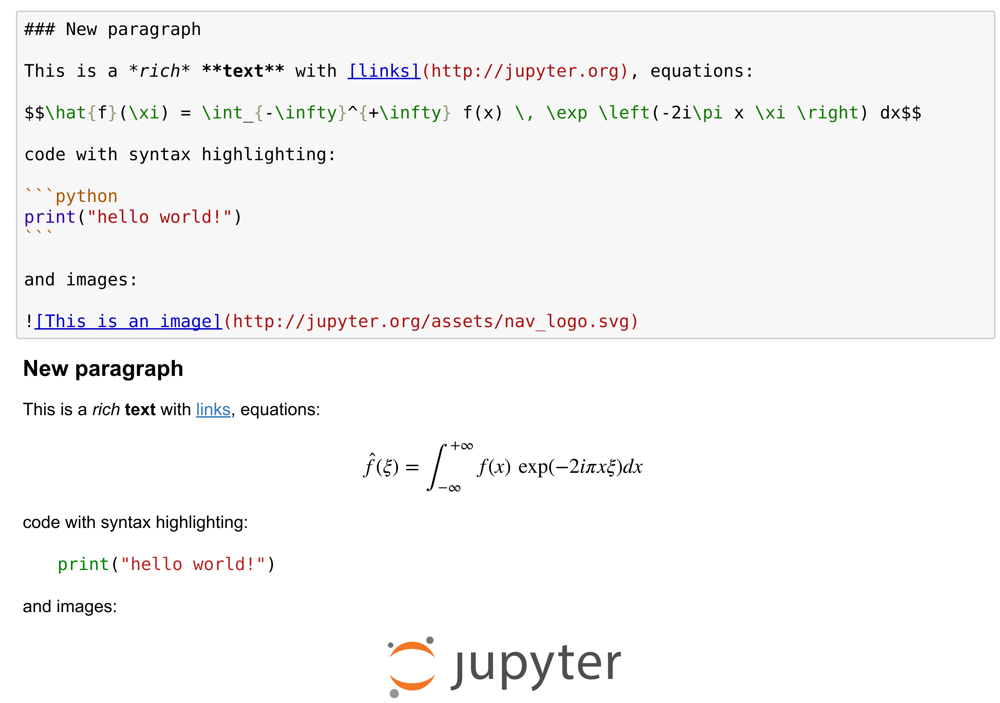
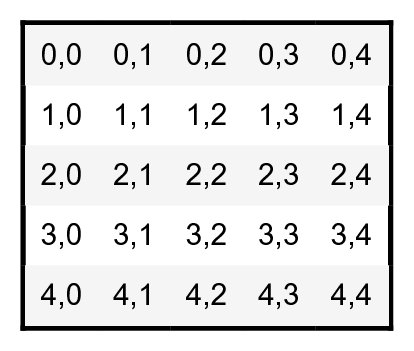

[*第一章：Jupyter与IPython互动计算之旅*](./)

# 1.1. 介绍IPython和Jupyter Notebook

**Jupyter Notebook**是一个基于web的交互环境，它将代码、富文本、图像、视频、动画、数学方程、绘图、地图、交互式图形和小部件以及图形用户界面组合到一个文档中。这个工具是在Python、R、Julia或其他语言中实现高性能数值计算和数据科学的理想门户。在本书中，我们将主要使用Python语言，尽管有介绍R和Julia的片段。

在这个参考手册中，我们将介绍IPython和Jupyter Notebook。

## 准备工作

本章的介绍给出了安装Anaconda发行版的说明，它附带了Jupyter和我们将在本书中使用的几乎所有Python库。

安装Anaconda后，从该书的网站下载代码并在该文件夹中打开终端。在终端机上，键入`jupyter notebook`。您的默认web浏览器应该自动打开并加载地址`http://localhost:8888`(在您的计算机上运行的服务器)。你就准备好开始了!

## 怎么做...

1. 让我们使用IPython内核创建一个新的Jupyter Notebook。我们在单元格中键入以下命令，然后按`Shift Enter`来执行：

```python
print("Hello world!")
```

```{output:stdout}
Hello world!
```



一个notebook包含**单元格**和**输出区域**的线性序列。单元格包含一行或多行Python代码。代码的输出显示在相应的输出区域中。

> 在这本书中，提示符`>>>`意味着您需要在它之后开始键入内容。`>>>`字符本身不应该被输入。

2. 现在，我们做一个简单的算术运算:

```python
2 + 2
```

```{output:result}
4
```

操作结果显示在输出区域中。更准确地说，输出区域不仅显示单元格中任何命令打印的文本，而且还显示最后返回对象的文本表示。这里，最后返回的对象是`2+2`的结果，即`4`。

3. 在下一个单元格中，我们可以使用`_`(下划线)特殊变量恢复最后返回的对象的值。在实践中，将对象分配给命名变量可能更方便，比如`myresult = 2 + 2`。

```python
_ * 3
```

```{output:result}
12
```

4. IPython不仅接受Python代码，而且接受shell命令。这些命令由操作系统提供。我们在输入shell命令之前键入`!`。这里，假设是Linux或macOS系统，我们得到当前目录中所有NoteBook的列表:

```python
!ls
```

```{output:stdout}
my_notebook.ipynb
```

在Windows上，可以将`ls`替换为`dir`。

5. IPython附带了一个由**魔法命令**组成的库。这些命令是常见操作的便捷快捷方式。它们都以`%`(百分比字符)开头。我们可以使用`%%lsmagic`获得所有魔法命令的列表：

```python
%lsmagic
```

```{output:result}
Available line magics:
%alias  %alias_magic  %autocall  %automagic  %autosave  %bookmark  %cat  %cd  %clear  %colors  %config  %connect_info  %cp  %debug  %dhist  %dirs  %doctest_mode  %ed  %edit  %env  %gui  %hist  %history  %killbgscripts  %ldir  %less  %lf  %lk  %ll  %load  %load_ext  %loadpy  %logoff  %logon  %logstart  %logstate  %logstop  %ls  %lsmagic  %lx  %macro  %magic  %man  %matplotlib  %mkdir  %more  %mv  %notebook  %page  %pastebin  %pdb  %pdef  %pdoc  %pfile  %pinfo  %pinfo2  %popd  %pprint  %precision  %profile  %prun  %psearch  %psource  %pushd  %pwd  %pycat  %pylab  %qtconsole  %quickref  %recall  %rehashx  %reload_ext  %rep  %rerun  %reset  %reset_selective  %rm  %rmdir  %run  %save  %sc  %set_env  %store  %sx  %system  %tb  %time  %timeit  %unalias  %unload_ext  %who  %who_ls  %whos  %xdel  %xmode

Available cell magics:
%%!  %%HTML  %%SVG  %%bash  %%capture  %%debug  %%file  %%html  %%javascript  %%js  %%latex  %%markdown  %%perl  %%prun  %%pypy  %%python  %%python2  %%python3  %%ruby  %%script  %%sh  %%svg  %%sx  %%system  %%time  %%timeit  %%writefile

Automagic is ON, % prefix IS NOT needed for line magics.
```

单元格魔法有一个`%%`前缀;它们以整个代码单元为目标。

6. 例如，`%%writefile`单元格魔法让我们创建一个文本文件。这个神奇的命令接受文件名作为参数。单元格中剩余的所有行都直接写入这个文本文件。在这里，我们创建一个文件`test.txt`并将`Hello world！`写入其中：

```python
%%writefile test.txt
Hello world!
```

```{output:stdout}
Writing test.txt
```

```python
# Let's check what this file contains.
with open('test.txt', 'r') as f:
    print(f.read())
```

```{output:stdout}
Hello world!
```

7. 正如我们在`%lsmagic`的输出中所看到的，IPython中有许多神奇的命令。我们可以通过在命令后面添加`? `来查找有关任何命令的更多信息。例如，为了获得关于`%Run`魔法命令的一些帮助，我们键入`%Run? `，如下所示：

```python
%run?
```



在屏幕底部的文本区域会打开并显示`%Run`魔法命令的帮助。

8. 我们介绍了IPython和NoteBook的基础知识。现在让我们来看看NoteBook的丰富的显示和交互功能。到目前为止，我们只创建了**代码单元格**(包含代码)。Jupyter支持其他类型的单元格。在NoteBook工具栏中，有一个下拉菜单来选择单元格的类型.代码单元之后最常见的单元格类型是**Markdown单元格**。

Markdown单元格包含用**Markdown**格式化的富文本，这是一种流行的纯文本格式语法。这种格式支持普通文本、标头、粗体、斜体、超文本链接、图像、`LaTex`(一种适合于数学的排版系统)中的数学方程、代码、HTML元素和其他特性，如下所示:



运行Markdown单元格(例如，按下`Shift + Enter`)会显示输出，如上面的屏幕截图底部面板所示。

通过组合代码单元和标记单元，我们创建了一个独立的交互式文档，它将计算(代码)、文本和图形组合在一起。

9. Jupyter Notebook还配备了一个复杂的显示系统，可以让我们在NoteBook中插入丰富的web元素。在这里，我们将展示如何在NoteBook中添加HTML、**SVG(可缩放矢量图形)**，甚至YouTube视频。首先，我们需要导入一些类:

```python
from IPython.display import HTML, SVG, YouTubeVideo
```

10. 我们用Python动态地创建一个HTML table，并将它显示在(基于HTML的)NoteBook中。

```python
HTML('''
<table style="border: 2px solid black;">
''' +
     ''.join(['<tr>' +
              ''.join([f'<td>{row},{col}</td>'
                       for col in range(5)]) +
              '</tr>' for row in range(5)]) +
     '''
</table>
''')
```



11. 与之类似，我们动态地创建SVG图形：

```python
SVG('''<svg width="600" height="80">''' +
    ''.join([f'''<circle
              cx="{(30 + 3*i) * (10 - i)}"
              cy="30"
              r="{3. * float(i)}"
              fill="red"
              stroke-width="2"
              stroke="black">
        </circle>''' for i in range(10)]) +
    '''</svg>''')
```


12. 我们通过将YouTube视频的标识符命名为`YoutubeVideo`来显示YouTube视频：

```python
YouTubeVideo('VQBZ2MqWBZI')
```


## There's more...
## 还有更多...

NoteBook被保存为结构化文本文件(JSON格式)，这使得它们易于共享。以下是一个简单NoteBook的内容：

```json
{
 "cells": [
  {
   "cell_type": "code",
   "execution_count": 1,
   "metadata": {},
   "outputs": [
    {
     "name": "stdout",
     "output_type": "stream",
     "text": [
      "Hello world!\n"
     ]
    }
   ],
   "source": [
    "print(\"Hello world!\")"
   ]
  }
 ],
 "metadata": {},
 "nbformat": 4,
 "nbformat_minor": 2
}
```

Jupyter附带一个特殊的工具**nbconvert**，它将NoteBook转换成其他格式，比如HTML和PDF (https://nbconvert.readthedocs.io/en/stable/)。

另一个在线工具**nbviewer** (http://nbviewer.jupyter.org)允许我们在浏览器中直接呈现公开可用的NoteBook。

我们将在后面的章节中介绍这些，特别是在*第3章《精通NoteBook》*中。

Jupyter Notebook前端还有其他实现，它们提供了与相同NoteBook文档交互的不同方式。**Jupyterlab**是交互式计算和数据科学的IDE，是Jupyter Notebook的未来。第三章对此进行了介绍。**nteract**是一个桌面应用程序，允许用户通过双击打开一个NoteBook文件，无需使用终端和web浏览器。**Hydrogen**是Atom文本编辑器的插件，在打开NoteBook文件时提供了丰富的交互功能。**Juno*是iPad上的Jupyter Notebook客户端。

以下是一些关于这本NoteBook的参考资料:

* Installing Jupyter, available at http://jupyter.org/install.html
* Documentation of the Notebook available at http://jupyter.readthedocs.io/en/latest/index.html
* Security in Jupyter notebooks, at https://jupyter-notebook.readthedocs.io/en/stable/security.html#Security-in-notebook-documents
* User-curated gallery of interesting notebooks available at https://github.com/jupyter/jupyter/wiki/A-gallery-of-interesting-Jupyter-Notebooks
* JupyterLab at https://github.com/jupyterlab/jupyterlab
* nteract at https://nteract.io
* Hydrogen at https://nteract.io/atom
* Juno at https://juno.sh/

## 另请参阅

* 开始在Jupyter Notebook上进行数据探索性分析
* 引入Jupyterlab
