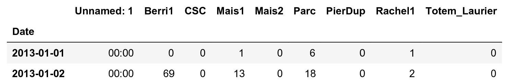
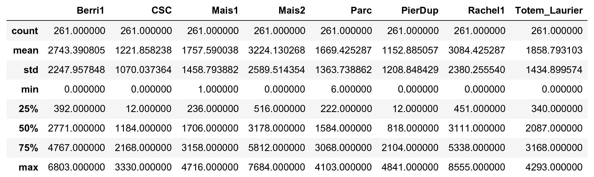
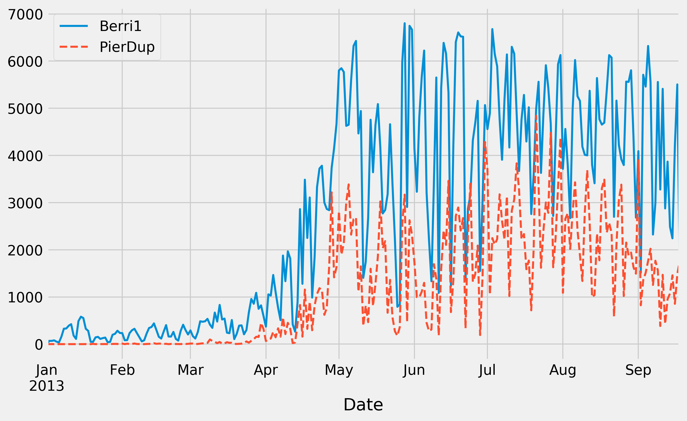
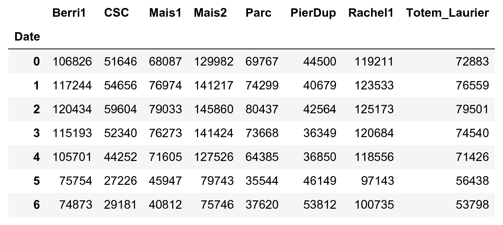
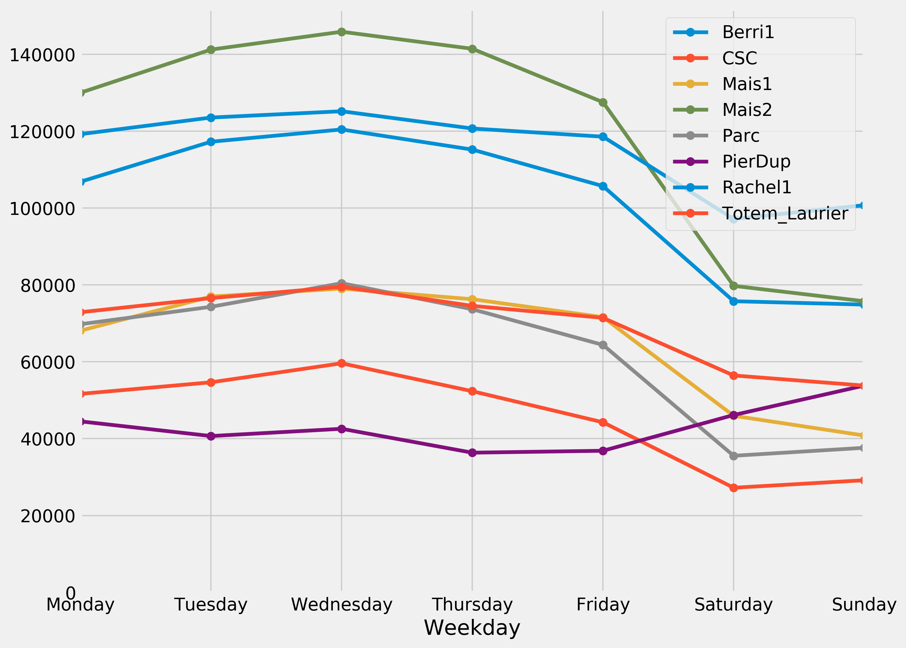
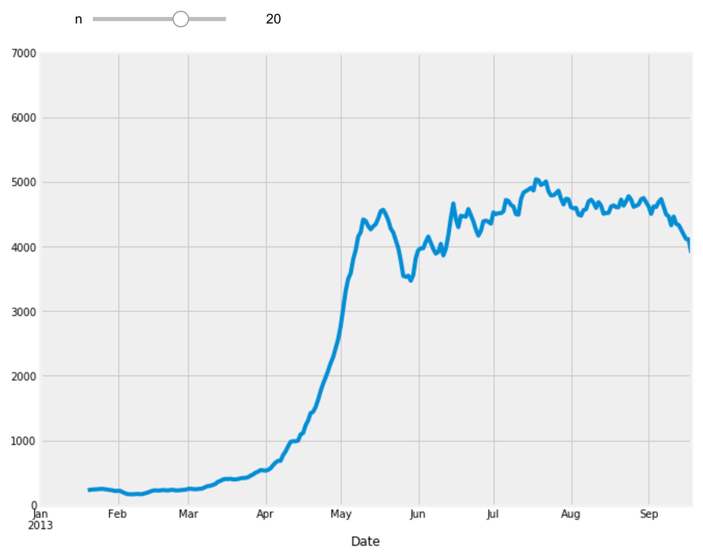

[*Chapter 1 : A Tour of Interactive Computing with Jupyter and IPython*](./)
[*第一章：Jupyter与IPython互动计算之旅*](./)

# 1.2. Getting started with exploratory data analysis in the Jupyter Notebook
# 1.2. 开始在Jupyter Notebook上进行探索性的数据分析


We will download and analyze a dataset about attendance on Montreal's bicycle tracks. This example is largely inspired by a presentation from Julia Evans (available at https://github.com/jvns/talks/blob/master/2013-04-mtlpy/pistes-cyclables.ipynb). Specifically, we will introduce the following:
我们将下载并分析蒙特利尔道路上自行车的数据集。这个例子很大程度上受到了JuliaEvans的启发(可在https：/github.com/jvns/talk/blob/master/2013-04-mtlpy/istes-cyclables.ipynb上找到)。具体来说，我们将介绍以下几点：

* Data manipulation with pandas
* 使用Pandas数据处理
* Data visualization with matplotlib
* 使用matplotlib的可视化数据
* Interactive widgets
* 交互式窗口小部件

## How to do it...
## 怎么做...

1. The very first step is to import the scientific packages we will be using in this recipe, namely NumPy, pandas, and matplotlib. We also instruct matplotlib to render the figures as inline images in the Notebook:
1. 第一步是导入我们将在此参考手册中使用的科学软件包，即NumPy、panda和matplotlib。我们还指示matplotlib在NoteBook中将数字渲染为内联图像:

```python
import numpy as np
import pandas as pd
import matplotlib.pyplot as plt
%matplotlib inline
```

> We can enable high-resolution matplotlib figures on Retina display systems with the following commands:
> 我们可以使用以下命令在Retina显示系统上启用高分辨率matplotlib图形：
>
>
```python
> from IPython.display import set_matplotlib_formats
> set_matplotlib_formats('retina')
```

2. Now, we create a new Python variable called `url` that contains the address to a **CSV (Comma-separated values)** data file. This standard text-based file format is used to store tabular data:
2. 现在，我们创建一个名为`url`的新的Python变量，它包含一个**CSV(逗号分隔值)**数据文件的地址。这种基于文本的标准文件格式用于存储表格数据:

```python
url = ("https://raw.githubusercontent.com/"
       "ipython-books/cookbook-2nd-data/"
       "master/bikes.csv")
```

3. pandas defines a `read_csv()` function that can read any CSV file. Here, we pass the URL to the file. pandas will automatically download the file, parse it, and return a `DataFrame` object. We need to specify a few options to make sure that the dates are parsed correctly:
3. Pandas定义了一个`read_csv()`函数，它可以读取任何CSV文件。在这里，我们将URL传递给文件。Pandas将自动下载该文件，解析它，并返回一个`DataFrame‘对象。我们需要指定几个选项，以确保正确解析日期：

```python
df = pd.read_csv(url, index_col='Date',
                 parse_dates=True, dayfirst=True)
```

4. The `df` variable contains a **DataFrame** object, a specific pandas data structure that contains 2D tabular data. The `head(n)` method displays the first `n` rows of this table. In the Notebook, pandas displays a `DataFrame` object in an HTML table, as shown in the following screenshot:
4. `df`变量包含一个**DataFrame**对象，这是一个包含2D表格数据的特定Pandas数据结构。`head(n)`方法显示该表的第n行。在NoteBook中，panda在HTML table中显示了一个`DataFrame`对象，如下面的截图所示:

```python
df.head(2)
```



Here, every row contains the number of bicycles on every track of the city, for every day of the year.
在这里，每一行都包含着城市每条车道上的自行车数量，当年每一天都是如此。

5. We can get some summary statistics of the table with the `describe()` method:
5. 我们可以使用`describe()`方法得到该表的一些汇总统计信息:

```python
df.describe()
```



6. Let's display some figures. We will plot the daily attendance of two tracks. First, we select the two columns, `Berri1` and `PierDup`. Then, we call the `plot()` method:
6. 让我们展示一些数字。我们将画出两首歌的每日出勤情况。首先选择`Berri 1`和`PierDup`两列。然后调用`plot()‘方法：

```python
df[['Berri1', 'PierDup']].plot(figsize=(10, 6),
                               style=['-', '--'],
                               lw=2)
```



7. Now, we move to a slightly more advanced analysis. We will look at the attendance of all tracks as a function of the weekday. We can get the weekday easily with pandas: the `index` attribute of the `DataFrame` object contains the dates of all rows in the table. This index has a few date-related attributes, including `weekday_name`:
7. 现在，我们来做一个稍微高级一些的分析。我们将视所有轨道的出席情况作为平日的一项功能。我们可以轻松地用Pandas获得工作日数据：`DataFrame`对象的`index`属性包含表中所有行的日期。此索引具有一些与日期相关的属性，包括`weekday_name`：

```python
df.index.weekday_name
```

```{output:result}
Index(['Tuesday', 'Wednesday', 'Thursday', 'Friday',
       'Saturday', 'Sunday', 'Monday', 'Tuesday',
       ...
       'Friday', 'Saturday', 'Sunday', 'Monday',
       'Tuesday', 'Wednesday'],
      dtype='object', name='Date', length=261)
```

8. To get the attendance as a function of the weekday, we need to group the table elements by the weekday. The `groupby()` method lets us do just that. We use `weekday` instead of `weekday_name` to keep the weekday order (Monday is 0, Tuesday is 1, and so on). Once grouped, we can sum all rows in every group:
8. 为了使出勤量作为工作日的一项功能，我们需要按工作日对表元素进行分组。`groupby()`方法可以实现。我们使用`weekday`而不是`weekday_name`来保持平日次序(星期一是0，星期二是1，等等)。分组后，我们可以对每组的所有行进行求和:

```python
df_week = df.groupby(df.index.weekday).sum()
```

```python
df_week
```



9. We can now display this information in a figure. We create a matplotlib figure, and we use the `plot()` method of a `DataFrame` to create our plot:
9. 现在，我们可以以图形的形式显示此信息。我们创建一个matplotlib图形，并使用`DataFrame`的`plot()`方法来创建我们的绘图:

```python
fig, ax = plt.subplots(1, 1, figsize=(10, 8))
df_week.plot(style='-o', lw=3, ax=ax)
ax.set_xlabel('Weekday')
# We replace the labels 0, 1, 2... by the weekday
# names.
ax.set_xticklabels(
    ('Monday,Tuesday,Wednesday,Thursday,'
     'Friday,Saturday,Sunday').split(','))
ax.set_ylim(0)  # Set the bottom axis to 0.
```



10. Finally, let's illustrate the interactive capabilities of the Notebook. We will plot a *smoothed* version of the track attendance as a function of time (**rolling mean**). The idea is to compute the mean value in the neighborhood of any day. The larger the neighborhood, the smoother the curve. We will create an interactive slider in the Notebook to vary this parameter in real time in the plot. All we have to do is add the `@interact` decorator above our plotting function:
10. 最后，我们来演示一下NoteBook的交互功能。我们将绘制一个**平滑**版本的车道出勤量作为时间的函数(**滚动平均**)。其思想是计算任意邻域的均值。邻域越大，曲线越平滑。我们将在NoteBook中创建一个交互式滑块，以便在绘图中实时更改此参数。我们所要做的就是在绘图函数上面添加`@interaction`装饰器:

```python
from ipywidgets import interact

@interact
def plot(n=(1, 30)):
    fig, ax = plt.subplots(1, 1, figsize=(10, 8))
    df['Berri1'].rolling(window=n).mean().plot(ax=ax)
    ax.set_ylim(0, 7000)
    plt.show()
```



## How it works...
## 它是如何工作的…

To create matplotlib figures, it is good practice to create a Figure (`fig`) and one or several Axes (subplots, `ax` object) with the `plt.subplots()` command. The `figsize` keyword argument lets us specify the size of the figure, in inches. Then, we call plotting methods directly on the Axes instances. Here, for example, we set the y limits of the axis with the `set_ylim()` method. If there are existing plotting commands, like the `plot()` method provided by pandas on DataFrame instances, we can pass the relevant Axis instance with the `ax` keyword argument.
要创建matplotlib图形，很好的做法是使用`plt.subplots()`命令创建一个图形(`config`)和一个或多个轴(子图、`ax`Object)。关键字参数允许我们指定数字的大小(以英寸为单位)。然后，我们直接在轴实例上调用绘图方法。例如，在这里，我们用`set_ylim()`方法设置了轴的y限制。如果有现有的绘图命令，比如Pandas在DataFrame实例上提供的`plot()`方法，我们可以使用`ax`关键字参数传递相关的Axis实例。
要创建matplotlib图形，最好使用`pl.subplot()`命令创建一个图(`fig`)和一个或多个轴(子图，`ax`对象)。`figsize`关键字参数允许我们指定图形的大小(以英寸为单位)。然后，我们直接在Axes实例上调用绘图方法。例如，在这里，我们使用`set_ylim()`方法设置轴的y极限。如果存在现有的绘图命令，比如由panda在DataFrame实例上提供的`plot()`方法，我们可以通过`ax`关键字参数传递相关的Axis实例。 
## There's more...
## 还有更多...

pandas is the main data wrangling library in Python. Other tools and methods are generally required for more advanced analyses (signal processing, statistics, and mathematical modeling). We will cover these steps in the second part of this book, starting with *Chapter 7, Statistical Data Analysis*.
Pandas是Python中主要的数据整理(data wrangling)库。通常需要其他工具和方法进行更高级的分析(信号处理、统计和数学建模)。我们将在本书的第二部分中介绍这些步骤，从*第7章统计数据分析开始*。

Here are some more references about data manipulation with pandas:
下面是一些关于Pandas数据处理的参考资料:

* *Learning IPython for Interactive Computing and Data Visualization Second Edition, Packt Publishing*, the prequel of this book
* **学习交互式计算和数据可视化的IPython第二版，Packt Publishing**，这本书的前传
* *Python for Data Analysis*, O'Reilly Media, by Wes McKinney, the creator of pandas, at http://shop.oreilly.com/product/0636920023784.do
* **Python的数据分析**，O'Reilly Media，作者是Wes McKinney，Pandas的创造者， at http://shop.oreilly.com/product/0636920023784.do
* *Python Data Science Handbook*, O'Reilly Media, by Jake VanderPlas, at http://shop.oreilly.com/product/0636920034919.do
* **Python数据科学手册**，O‘Reilly Media，Jake Vanderplas， at http://shop.oreilly.com/product/0636920034919.do
* The documentation of pandas available at http://pandas.pydata.org/pandas-docs/stable/
* 有Pandas的文件 at http://pandas.pydata.org/pandas-docs/stable/
* Usage guide of matplotlib, at https://matplotlib.org/tutorials/introductory/usage.html
* matplotlib使用指南， at https://matplotlib.org/tutorials/introductory/usage.html

## See also
## 另请参阅

* Introducing the multidimensional array in NumPy for fast array computations
* 在NumPy中引入多维数组，用于快速的数组计算
