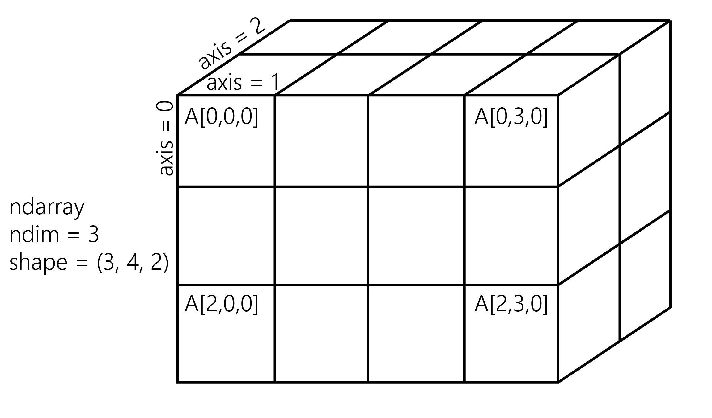

[*第一章：Jupyter与IPython互动计算之旅*](./)

# 1.3. 在NumPy中引入多维数组，用于快速的数组计算

NumPy是Python科学生态系统的主要基础。这个库为高性能的数值计算提供了一个特定的数据结构：**多维数组**。NumPy背后的基本原理是：Python是一种高级动态语言，它比C这样的低级语言更容易使用，但速度更慢。NumPy在C中实现了多维数组结构，并提供了方便的Python接口，从而将高性能和易用性结合在一起。许多Python库都使用NumPy。例如Pandas是建在NumPy上面的。

在这个参考手册中，我们将说明多维数组的基本概念。关于这个主题的更全面的信息可以在**Learning IPython用于交互计算和数据可视化的第二版**书中找到。

## 怎么做...

1. 让我们导入内置的`random`Python模块和NumPy：

```python
import random
import numpy as np
```

2. 我们生成了两个Python列表，`x`和`y`，每个列表包含100万个0到1之间的随机数:

```python
n = 1000000
x = [random.random() for _ in range(n)]
y = [random.random() for _ in range(n)]
```

```python
x[:3], y[:3]
```

```{output:result}
([0.926, 0.722, 0.962], [0.291, 0.339, 0.819])
```

3. 让我们计算所有这些数字的元素和:`x`的第一个元素加上`y`的第一个元素，以此类推。我们在列表理解中使用`for`循环:

```python
z = [x[i] + y[i] for i in range(n)]
z[:3]
```

```{output:result}
[1.217, 1.061, 1.781]
```

4. 这个计算需要多长时间? IPython定义了一个方便的`%timeit`魔法命令，用于快速评估单个语句占用的时间:

```python
%timeit [x[i] + y[i] for i in range(n)]
```

```{output:stdout}
101 ms ± 5.12 ms per loop (mean ± std. dev. of 7 runs,
    10 loops each)
```

5. 现在，我们将对NumPy执行相同的操作。NumPy在多维数组中工作，因此我们需要将列表转换为数组。`np.array()`函数就是这么做的:

```python
xa = np.array(x)
ya = np.array(y)
```

```python
xa[:3]
```

```{output:result}
array([ 0.926,  0.722,  0.962])
```

`xa`和`ya`数组包含的数字与原来的列表`x`和`y`中的数字完全相同。这些列表是`list`内置类的实例，而我们的数组是`ndarray`NumPy类的实例。在Python和NumPy中，这些类型的实现非常不同。在本例中，我们将看到使用数组而不是列表会导致显著的性能改进。

6. 为了计算这些数组的元素和，我们不再需要执行for循环。在NumPy中，添加两个数组意味着按组件添加数组的元素。这是线性代数(向量和矩阵的运算)中的标准数学符号:

```python
za = xa + ya
za[:3]
```

```{output:result}
array([ 1.217,  1.061,  1.781])
```

我们看到`z`列表和`za`数组包含相同的元素(`x`和`y`中的数字之和)。

> 当向量被表示为Python列表时，注意不要在向量之间使用`+`运算符!这个操作符在列表之间是有效的，因此它不会引起错误，并且可能导致细微的和无声的错误。实际上，`list1 + list2`是两个列表的串联，而不是元素的加法。

7. 让我们比较一下这个NumPy操作与本机Python循环的性能:

```python
%timeit xa + ya
```

```{output:stdout}
1.09 ms ± 37.3 µs per loop (mean ± std. dev. of 7 runs,
    1000 loops each)
```

使用NumPy，我们从100毫秒减少到1毫秒，计算了一百万次加法!

8. 现在，我们要计算其他的东西:`x`或`xa`中的所有元素的和。虽然这不是一个元素操作，但是NumPy在这里仍然非常高效。纯Python版本在iterable上使用内置的`sum()`函数。NumPy版本在NumPy数组上使用`np.sum()`函数:

```python
%timeit sum(x)  # pure Python
```

```{output:stdout}
3.94 ms ± 4.44 µs per loop (mean ± std. dev. of 7 runs
    100 loops each)
```

```python
%timeit np.sum(xa)  # NumPy
```

```{output:stdout}
298 µs ± 4.62 µs per loop (mean ± std. dev. of 7 runs,
    1000 loops each)
```

我们在这里也观察到了一个显著的加速现象。

9. 最后，让我们执行最后一个操作：计算两个列表中任意一对数字之间的算术距离(我们只考虑前1000个元素以保持计算时间的合理性)。首先，我们使用两个嵌套的`for‘循环在纯Python中实现了这一点：

```python
d = [abs(x[i] - y[j])
     for i in range(1000)
     for j in range(1000)]
```

```python
d[:3]
```

```{output:result}
[0.635, 0.587, 0.106]
```

10. 现在，我们使用NumPy实现，提出了两个稍微先进的概念。首先，我们考虑一个**二维数组**(或矩阵)。这就是我们如何处理`I`和`j`这两个指数的方法。其次，我们使用**broadcasting**来执行2D数组和一维数组之间的操作。我们将在*它是如何工作的部分*给出更多的细节。

```python
da = np.abs(xa[:1000, np.newaxis] - ya[:1000])
```

```python
da
```

```{output:result}
array([[ 0.635,  0.587,  ...,  0.849,  0.046],
       [ 0.431,  0.383,  ...,  0.646,  0.158],
       ...,
       [ 0.024,  0.024,  ...,  0.238,  0.566],
       [ 0.081,  0.033,  ...,  0.295,  0.509]])
```

```python
%timeit [abs(x[i] - y[j]) \
         for i in range(1000) \
         for j in range(1000)]
```

```{output:stdout}
134 ms ± 1.79 ms per loop (mean ± std. dev. of 7 runs,
    1000 loops each)
```

```python
%timeit np.abs(xa[:1000, np.newaxis] - ya[:1000])
```

```{output:stdout}
1.54 ms ± 48.9 µs per loop (mean ± std. dev. of 7 runs
    1000 loops each)
```

Here again, we observe a significant speedup.
在这里，我们再次观察到一个显著的加速。

## 它是如何工作的.。

NumPy阵列是一个在多维有限网格中组织的均匀数据块。数组的所有元素共享相同的**数据类型**，也称为**dtype**(整数、浮点数等等)。数组的**形状**是一个n元组，它给出每个轴的大小。

一维数组是**向量**；它的形状只是分量的数量。

二维阵列为**矩阵**;它的形状是`(行数，列数)`。

下图说明了包含24个元素的3D`(3，4，2)`数组的结构：



Python中的切片语法很好地转换为NumPy中的数组索引。此外，我们还可以在索引中使用`np.newaxis`向现有数组添加一个额外的维度。

元素级算术操作可以对具有**相同形状**的NumPy数组执行。但是，广播允许在某些条件下对不同形状的数组进行操作，从而放松了这一条件。值得注意的是，当一个数组的维数比另一个数组少时，它实际上可以被拉伸以匹配另一个数组的维数。这就是我们如何计算`xa`和`ya`中任何一对元素之间的成对距离。

数组操作怎么能比Python循环快得多呢? 有几个原因，我们将在**第4章，分析和优化**详细回顾它们。我们在这里已经可以说：

* 在NumPy中，数组操作是用C循环而不是Python循环在内部实现的。Python通常比C慢，因为它具有解释性和动态类型的特性。
* NumPy数组中的数据存储在RAM中的**连续**内存块中。此属性可以更有效地使用CPU周期和缓存。

## 还有更多...

There's obviously much more to say about this subject. The prequel of this book, *Learning IPython for Interactive Computing and Data Visualization Second Edition*, contains more details about basic array operations. We will use the array data structure routinely throughout this book. Notably, *Chapter 4, Profiling and Optimization*, covers advanced techniques of using NumPy arrays.
关于这个问题，显然还有更多的话要说。这本书的前传，**学习交互式计算和数据可视化第二版的IPython，包含更多关于基本数组操作的详细信息。我们将在整本书中经常使用数组数据结构。值得注意的是，**第4章，分析和优化*，涵盖了使用NumPy数组的高级技术。

以下是一些参考资料:

* 关于NumPy中ndarray的文档介绍 at http://docs.scipy.org/doc/numpy/reference/arrays.ndarray.html
* 有关可用的NumPy数组的教程 at https://docs.scipy.org/doc/numpy-dev/user/quickstart.html
* SciPy讲义中的NumPy数组， at http://scipy-lectures.github.io/intro/numpy/array_object.html
* MATLAB用户使用NumPy， at https://docs.scipy.org/doc/numpy-dev/user/numpy-for-matlab-users.html

## 另请参阅

* 开始在Jupyter Notebook上进行数据探索性分析
* 了解NumPy的内部结构，以避免不必要的数组复制
