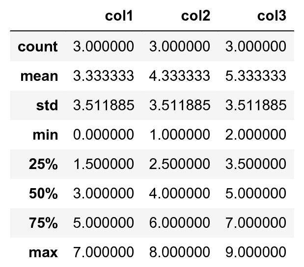

[*第一章：Jupyter与IPython互动计算之旅*](./)

# 1.4. 使用自定义魔法命令创建IPython扩展

尽管IPython附带了各种各样的神奇命令，但在某些情况下，我们需要在新的魔法命令中实现自定义功能。在这个参考手册中，我们将展示如何创建行魔法和魔法单元，以及如何将它们集成到IPython扩展中。

## 怎么做...

1. 让我们从IPython魔法系统导入几个函数：

```python
from IPython.core.magic import (register_line_magic,
                                register_cell_magic)
```

2. 定义一个新的行魔法特别简单。首先，我们创建一个接受行内容的函数(除了初始的`%` -前缀名)。这个函数的名字就是魔法的名字。然后，我们用`@register_line_magic`来装饰这个函数:

```python
@register_line_magic
def hello(line):
    if line == 'french':
        print("Salut tout le monde!")
    else:
        print("Hello world!")
```

```python
%hello
```

```{output:stdout}
Hello world!
```

```python
%hello french
```

```{output:stdout}
Salut tout le monde!
```

3. 让我们创建一个更有用的`%%csv`单元格魔法，它解析csv字符串并返回一个panda`DataFrame`对象。这一次，函数的参数是命令的选项和单元格的内容。

```python
import pandas as pd
from io import StringIO

@register_cell_magic
def csv(line, cell):
    # We create a string buffer containing the
    # contents of the cell.
    sio = StringIO(cell)
    # We use Pandas' read_csv function to parse
    # the CSV string.
    return pd.read_csv(sio)
```

```python
%%csv
col1,col2,col3
0,1,2
3,4,5
7,8,9
```


We can access the returned object with `_`.
我们可以使用`_`访问返回的对象。

```python
df = _
df.describe()
```



4. 我们描述的方法在交互式会话中非常有用。如果我们想在多个NoteBook中使用相同的魔法，或者想分发它，那么我们需要创建一个**IPython扩展**来实现我们的定制魔法命令。第一步是创建一个Python脚本(' csvmagic。在这里)那实现魔法。我们还需要定义一个特殊的函数`load_ipython_extension(ipython)`:

```python
%%writefile csvmagic.py
import pandas as pd
from io import StringIO

def csv(line, cell):
    sio = StringIO(cell)
    return pd.read_csv(sio)

def load_ipython_extension(ipython):
    """This function is called when the extension is
    loaded. It accepts an IPython InteractiveShell
    instance. We can register the magic with the
    `register_magic_function` method of the shell
    instance."""
    ipython.register_magic_function(csv, 'cell')
```

```{output:stdout}
Writing csvmagic.py
```

5. 一旦创建了扩展模块，我们需要将其导入到IPython会话中。我们可以使用`%load_ext`魔法命令来做这件事。在这里，加载扩展立即在交互式shell中注册我们的`%%csv`魔法函数：

```python
%load_ext csvmagic
```

```python
%%csv
col1,col2,col3
0,1,2
3,4,5
7,8,9
```


## 它是如何工作的.。

IPython扩展是一个Python模块，它实现顶级的load_ipython_extension(IPython)函数。当调用`%load_ext`魔法命令时，将加载模块，并调用`load_ipython_extension(ipython)`函数。此函数作为参数传递给当前的`InteractiveShell`实例。这个对象实现了几个方法，我们可以使用这些方法与当前的IPython会话进行交互。

### InteractiveShell类

交互式IPython会话由`InteractiveShell‘类的(单例)实例表示。此对象处理会话中的历史记录、交互式命名空间和大多数可用功能。

在交互式shell中，我们可以使用`get_ipython()`函数获得当前`InteractiveShell`实例。

`InteractiveShell`的所有方法的列表可以在引用API中找到(请参阅本参考手册末尾的引用)。以下是最重要的属性和方法:

* `user_ns`：用户名称空间(字典)。
* `Push()`：在交互式命名空间中推送(或注入)Python变量。
* `ev()`：计算用户命名空间中的Python表达式。
* `ex()`：在用户命名空间中执行Python语句。
* `run_cell()`:运行一个单元格(作为字符串给出)，可能包含IPython魔法命令。
* `Safe_execfile()`：安全地执行Python脚本。
* `system()`: 执行系统命令。
* `write()`：将字符串写入默认输出。
* `write_err()‘：将字符串写入默认错误输出。
* `register_magic_function()`:将独立函数注册为IPython魔法函数。我们在这个参考手册中使用了这个方法。

### 加载扩展

当使用`%load_ext`时，Python扩展模块需要是可导入的。在这里，我们的模块位于当前目录中。在其他情况下，它必须在Python路径中。它也可以存储在`~/.ipython/exsions‘中，它会自动放入Python路径中。

为了确保在IPython概要文件中自动定义了魔法，我们可以指示IPython在启动新的交互式shell时自动加载扩展。为此，我们必须打开`~/.ipython/profile_default/ipython_config`。在c.InteractiveShellApp中加入csvmagic文件。扩展的列表。`csvmagic`模块需要是可输入的。创建实现IPython扩展的Python包是很常见的，它本身定义了定制的魔法命令。

## 还有更多...

存在许多第三方扩展和神奇命令，例如`%%cython`魔法允许人们直接在NoteBook中编写Cython代码。

以下是一些参考资料：

* 提供IPython扩展系统的文档 http://ipython.readthedocs.io/en/stable/config/extensions/index.html
* 定义新的魔法命令解释 http://ipython.readthedocs.io/en/stable/config/custommagics.html
* IPython扩展索引 https://github.com/ipython/ipython/wiki/Extensions-Index
* 提供InteractiveShell的API参考 at http://ipython.readthedocs.io/en/stable/api/generated/IPython.core.interactiveshell.html

## 另请参阅

* 掌握IPython的配置系统
