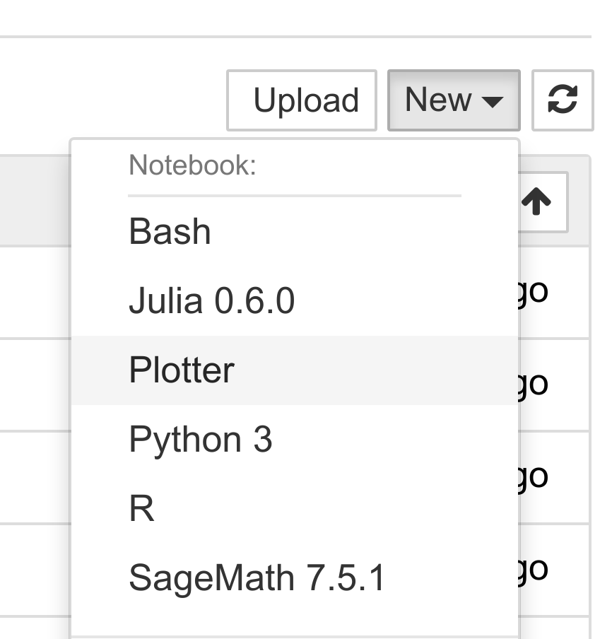
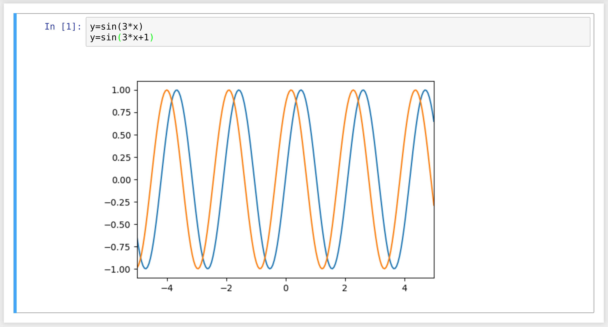

[*第一章：Jupyter与IPython互动计算之旅*](./)

# 1.6. 为Jupyter创建一个简单的内核

Jupyter的架构是语言独立的。客户端和内核之间的解耦使得用任何语言编写内核成为可能。客户端通过基于套接字的消息传递协议与内核通信。

然而，消息传递协议很复杂。从头编写一个新的内核并不简单。幸运的是，Jupyter为内核语言提供了一个可以用Python包装的轻量级接口。

这个接口还可以用来在Jupyter Notebook(或者另一个客户端应用程序，如控制台)中创建一个完全定制的体验。通常，Python代码必须在每个代码单元格中编写；但是，我们可以为任何特定于域的语言编写内核。我们只需编写一个Python函数，它接受一个代码字符串作为输入(代码单元格的内容)，并将文本或富数据作为输出发送。我们还可以轻松地实现代码完成和代码检查。

我们可以想象许多有趣的交互式应用程序，它们远远超出了Jupyter最初的用例。这些应用程序可能对非程序员终端用户(如高中生)特别有用。

在这个参考手册中，我们将创建一个简单的图形计算器。计算器由NumPy和matplotlib透明地支持。我们只需在代码单元格中将函数写成`y=f(X)`才能得到这些函数的图。

## 怎么做...

1. 首先，我们创建一个`plotkernel.py‘文件。此文件将包含自定义内核的实现。让我们导入几个模块：

```python
%%writefile plotkernel.py

from ipykernel.kernelbase import Kernel
import numpy as np
import matplotlib.pyplot as plt
from io import BytesIO
import urllib, base64
```

```{output:stdout}
Writing plotkernel.py
```

2. 我们编写了一个函数，它返回一个matplotlib图形的base64编码的PNG格式表示的图像:

```python
%%writefile plotkernel.py -a

def _to_png(fig):
    """Return a base64-encoded PNG from a
    matplotlib figure."""
    imgdata = BytesIO()
    fig.savefig(imgdata, format='png')
    imgdata.seek(0)
    return urllib.parse.quote(
        base64.b64encode(imgdata.getvalue()))
```

```{output:stdout}
Appending to plotkernel.py
```

3. 现在，我们编写一个函数来解析一个代码字符串，它的形式是`y = f(x)`，并返回一个NumPy函数。这里，`f`是一个可以使用NumPy函数的任意Python表达式:

```python
%%writefile plotkernel.py -a

_numpy_namespace = {n: getattr(np, n)
                    for n in dir(np)}
def _parse_function(code):
    """Return a NumPy function from a
    string 'y=f(x)'."""
    return lambda x: eval(code.split('=')[1].strip(),
                          _numpy_namespace, {'x': x})
```

```{output:stdout}
Appending to plotkernel.py
```

4. 对于新的包装器内核，我们创建一个从`Kernel`派生的类。我们需要提供一些元数据字段：

```python
%%writefile plotkernel.py -a

class PlotKernel(Kernel):
    implementation = 'Plot'
    implementation_version = '1.0'
    language = 'python'  # will be used for
                         # syntax highlighting
    language_version = '3.6'
    language_info = {'name': 'plotter',
                     'mimetype': 'text/plain',
                     'extension': '.py'}
    banner = "Simple plotting"
```

```{output:stdout}
Appending to plotkernel.py
```

5. 在这个类中，我们实现了一个`do_execute()`方法，该方法接受代码作为输入并向客户端发送响应：

```python
%%writefile plotkernel.py -a

    def do_execute(self, code, silent,
                   store_history=True,
                   user_expressions=None,
                   allow_stdin=False):

        # We create the plot with matplotlib.
        fig, ax = plt.subplots(1, 1, figsize=(6,4),
                               dpi=100)
        x = np.linspace(-5., 5., 200)
        functions = code.split('\n')
        for fun in functions:
            f = _parse_function(fun)
            y = f(x)
            ax.plot(x, y)
        ax.set_xlim(-5, 5)

        # We create a PNG out of this plot.
        png = _to_png(fig)

        if not silent:
            # We send the standard output to the
            # client.
            self.send_response(
                self.iopub_socket,
                'stream', {
                    'name': 'stdout',
                    'data': ('Plotting {n} '
                             'function(s)'). \
                            format(n=len(functions))})

            # We prepare the response with our rich
            # data (the plot).
            content = {
                'source': 'kernel',

                # This dictionary may contain
                # different MIME representations of
                # the output.
                'data': {
                    'image/png': png
                },

                # We can specify the image size
                # in the metadata field.
                'metadata' : {
                      'image/png' : {
                        'width': 600,
                        'height': 400
                      }
                    }
            }

            # We send the display_data message with
            # the contents.
            self.send_response(self.iopub_socket,
                'display_data', content)

        # We return the exection results.
        return {'status': 'ok',
                'execution_count':
                    self.execution_count,
                'payload': [],
                'user_expressions': {},
               }
```

```{output:stdout}
Appending to plotkernel.py
```

6. 最后，在文件末尾添加以下行：

```python
%%writefile plotkernel.py -a

if __name__ == '__main__':
    from ipykernel.kernelapp import IPKernelApp
    IPKernelApp.launch_instance(
        kernel_class=PlotKernel)
```

```{output:stdout}
Appending to plotkernel.py
```

7. 我们的内核准备好了！下一步是向Jupyter表明这个新内核是可用的。为此，我们需要在子目录中创建一个**内核规范**`kernel.json‘文件，如下所示：

```python
%mkdir -p plotter/
```

```python
%%writefile plotter/kernel.json
{
 "argv": ["python", "-m",
          "plotkernel", "-f",
          "{connection_file}"],
 "display_name": "Plotter",
 "name": "Plotter",
 "language": "python"
}
```

```{output:stdout}
Writing plotter/kernel.json
```

8. 我们安装内核：

```python
!jupyter kernelspec install --user plotter
```

```{output:stdout}
[InstallKernelSpec] Installed kernelspec plotter in
~/.local/share/jupyter/kernels/plotter
```

9. Plotter内核现在出现在内核列表中：

```python
!jupyter kernelspec list
```

```{output:stdout}
Available kernels:
  bash         ~/.local/share/jupyter/kernels/bash
  ir           ~/.local/share/jupyter/kernels/ir
  plotter      ~/.local/share/jupyter/kernels/plotter
  sagemath     ~/.local/share/jupyter/kernels/sagemath
  ...
```

`plotkernel.py`文件需要导入到Python。例如，我们可以简单地将它放在当前目录中。

10. 现在，如果我们刷新Jupyter主NoteBook页面(或者在需要重新启动Jupyter Notebook服务器之后)，我们会看到我们的绘图仪内核出现在内核列表中:



11. 让我们用`Plotter`内核创建一个新的NoteBook。在这里，我们可以简单地在`y=f(X)`的形式下写出数学方程。相应的图形出现在输出区域中。以下是一个例子：



## 它是如何工作的.。

内核和客户端生活在不同的进程中。它们通过在网络套接字之上实现的消息传递协议进行通信。目前，这些消息是用JSON编码的，JSON是一种结构化的、基于文本的文档格式.

我们的内核从客户机(例如NoteBook)接收代码。当用户发送单元格代码时，将调用`do_execute()`函数。

内核可以使用`self.send_response()`方法将消息发送回客户端:

* 第一个参数是套接字，这里是`IOPub`套接字
* 第二个参数是消息类型，这里是`stream`，用于发回标准输出或标准错误，或`display_data`用于发回富数据
* 第三个参数是消息的内容，表示为Python字典

数据可以包含多个MIME表示：文本、HTML、SVG、图像等。由客户端来处理这些数据类型。特别是，NoteBook客户端知道如何在浏览器中表示所有这些类型。

函数在一个python字典中返回执行结果。

在这个玩具示例中，我们总是返回ok状态。在生产代码中，最好检测错误(例如函数定义中的语法错误)并返回错误状态。

下面可以找到所有消息传递协议的详细信息。

## 还有更多...

包装器内核可以实现可选方法，特别是用于代码完成和代码检查。例如，要实现代码完成，我们需要编写以下方法：

```
def do_complete(self, code, cursor_pos):
    return {'status': 'ok',
            'cursor_start': ...,
            'cursor_end': ...,
            'matches': [...]}
```

当游标位于代码单元中给定的`cursor_pos`位置时，每当用户请求完成代码时都会调用此方法。在方法的响应中，`cursor_start`和`cursor_end`字段表示代码补全应该覆盖输出的间隔。`matches`字段包含建议列表。

以下是一些参考资料：

* 包装器内核示例https://github.com/jupyter/echo_kernel
* 包装内核http://jupyter-client.readthedocs.io/en/latest/wrapperkernels.html
* Jupyter的通讯协议， at https://jupyter-client.readthedocs.io/en/latest/messaging.html#execution-results
* 为Jupyter生成内核， at http://jupyter-client.readthedocs.io/en/latest/kernels.html
* 在Jupyter中使用c++， at https://blog.jupyter.org/interactive-workflows-for-c-with-jupyter-fe9b54227d92
