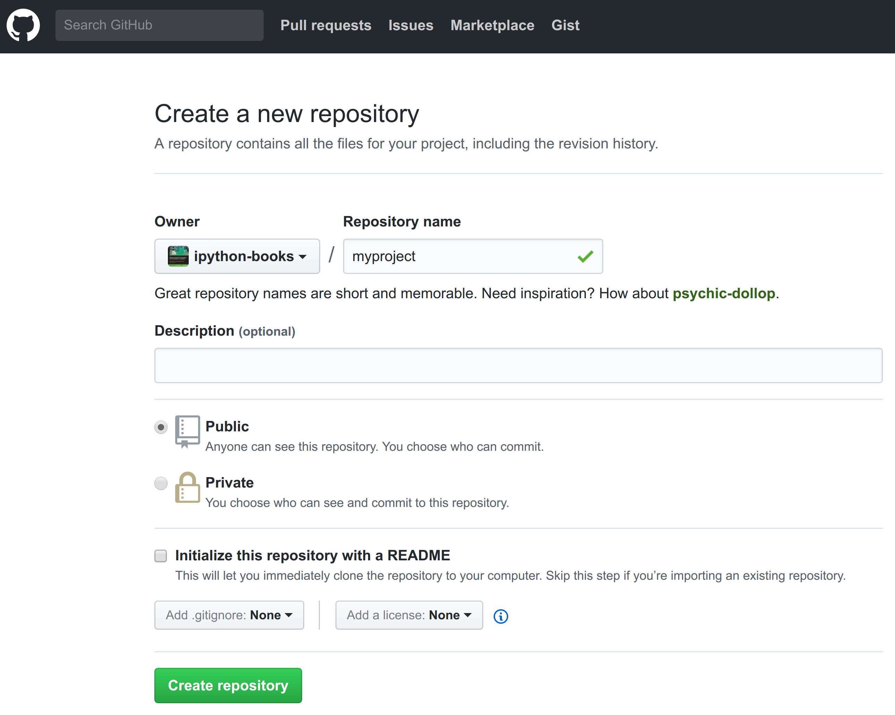

[*Chapter 2 : Best practices in Interactive Computing*](./)
[*第二章：交互计算之最佳实践*](../)

# 2.3. Learning the basics of the distributed version control system Git
# 2.3. 学习分布式版本控制系统git的基础知识

Using a **version control system** is an absolute requirement in programming and research. This is the tool that makes it barely impossible to lose one's work. In this recipe, we will cover the basics of Git.
使用**版本控制系统**是编程和研究中的绝对要求。这是一种使人几乎不可能失去工作的工具。在这个参考手册中，我们将介绍Git的基础知识。

## Getting ready
## 准备工作

Notable distributed version control systems include **Git**, **Mercurial**, and **Bazaar**, among others. In this chapter, we will use the popular Git system. You can download the Git program and Git GUI clients from http://git-scm.com.
值得注意的分布式版本控制系统包括**Git**、**Mercurial**和**Bazaar**等。在本章中，我们将使用流行的Git系统。您可以从http://git-scm.com下载Git程序和Git GUI客户机。

> Distributed systems tend to be more popular than centralized systems such as SVN or CVS. Distributed systems allow local (offline) changes and offer more flexible collaboration systems.
> 与SVN或CVS等集中式系统相比，分布式系统更受欢迎。分布式系统允许本地(离线)更改，并提供更灵活的协作系统。

An online provider allows you to host your code in the cloud. You can use it as a backup of your work and as a platform to share your code with your colleagues. These services include **GitHub** (https://github.com), **Gitlab** (https://gitlab.com), and **Bitbucket** (https://bitbucket.org). All of these websites offer free and paid plans with unlimited public and/or private repositories.
在线提供商允许您将代码驻留在云平台。您可以将其用作工作的备份，并将其用作与同事共享代码的平台。这些服务包括**GitHub** (https://github.com)、**Gitlab** (https://gitlab.com)和**Bitbucket** (https://bitbucket.org)。所有这些网站都提供免费和付费的计划，拥有无限的公共和/或私人存储库。

GitHub offers desktop applications for Windows and macOS at https://desktop.github.com/.
GitHub在https://desktop.github.com/.上为Windows和MacOS提供桌面应用程序

This book's code is stored on GitHub. Most Python libraries are also developed on GitHub.
本书的代码存储在GitHub上。大多数Python库也是在GitHub上开发的。

## How to do it...
## 怎么做...

1. The very first thing to do when starting a new project or computing experiment is create a new folder locally:
1. 当开始一个新的项目或计算实验时，首先要做的是在本地创建一个新文件夹:

```bash
mkdir myproject
cd myproject
```

2. We initialize a Git repository:
2. 我们初始化一个Git存储库：

```bash
git init
```

```{output:stdout}
Initialized empty Git repository in
~/git/cookbook-2nd/chapter02/myproject/.git/
```

```bash
pwd
```

```{output:stdout}
~/git/cookbook-2nd/chapter02/myproject
```

```bash
ls -a
```

```{output:stdout}
.  ..  .git
```

Git created a  `.git` subdirectory that contains all the parameters and history of the repository.
GIT创建了一个`.git‘子目录，其中包含存储库的所有参数和历史记录。

3. Let's set our name and e-mail address globally:
3. 让我们设置全局的名称和电子邮件地址:

```bash
git config --global user.name "My Name"
git config --global user.email "me@home.com"
```

4. We create a new file, and we tell Git to track it:
4. 我们创建一个新文件，并告诉Git跟踪它：

```bash
echo "Hello world" > file.txt
git add file.txt
```

5. Let's create our first commit:
5. 让我们创建我们的第一个提交：

```bash
git commit -m "Initial commit"
```

```{output:stdout}
[master (root-commit) 02971c0] Initial commit
 1 file changed, 1 insertion(+)
 create mode 100644 file.txt
```

6. We can check the list of commits:
6. 我们可以检查提交的列表：

```bash
git log
```

```{output:stdout}
commit 02971c0e1176cd26ec33900e359b192a27df2821
Author: My Name <me@home.com>
Date:   Tue Dec 12 10:50:37 2017 +0100

    Initial commit
```

7. Next, we edit the file by appending an exclamation mark:
7. 接下来，我们通过添加一个感叹号来编辑文件:

```bash
echo "Hello world!" > file.txt
```

```bash
cat file.txt
```

```{output:stdout}
Hello world!
```

8. We can see the differences between the current state of our repository, and the state in the last commit:
8. 我们可以看到存储库的当前状态与上一次提交的状态之间的差异:

```bash
git diff
```

```{output:stdout}
diff --git a/file.txt b/file.txt
index 802992c..cd08755 100644
--- a/file.txt
+++ b/file.txt
@@ -1 +1 @@
-Hello world
+Hello world!
```

The output of `git diff` shows that the contents of `file.txt` were changed from `Hello world` to `Hello world!`. Git compares the states of all tracked files and computes the differences between the files.
`git Diffd`的输出显示，`file.txt`的内容从`Hello world`改为`Hello world！`。Git比较所有跟踪文件的状态并计算文件之间的差异。

9. We can also get a summary of the changes as follows:
9. 我们还可以得到以下更改的摘要：

```bash
git status
```

```{output:stdout}
On branch master
Changes not staged for commit:
  (use "git add <file>..." to update what will
      be committed)

    modified:   file.txt

no changes added to commit (use "git add")
```

```bash
git diff --stat
```

```{output:stdout}
 file.txt | 2 +-
 1 file changed, 1 insertion(+), 1 deletion(-)
```

The `git status` command gives a summary of all changes since the last commit. The `git diff --stat` command shows, for each modified text file, the number of changed lines.
`git status`命令总结了自上次提交以来的所有更改。`gitdiff-stat``命令显示每个修改后的文本文件的行数。
`git status`命令提供了自上次提交以来的所有更改的摘要。`git diff—stat`命令显示，对于每个修改后的文本文件，更改行数。

10. Finally, we commit our change with a shortcut that automatically adds all changes in the tracked files (`-a` option):
10. 最后，我们通过一个快捷方式提交更改，该快捷方式可以自动添加跟踪文件中的所有更改(`-a`选项):

```bash
git commit -am "Add exclamation mark to file.txt"
```

```{output:stdout}
[master 045df6a] Add exclamation mark to file.txt
 1 file changed, 1 insertion(+), 1 deletion(-)
```

```bash
git log
```

```{output:stdout}
commit 045df6a6f8a62b19f45025d15168d6d7382a8429
Author: My Name <me@home.com>
Date:   Tue Dec 12 10:59:39 2017 +0100

    Add exclamation mark to file.txt

commit 02971c0e1176cd26ec33900e359b192a27df2821
Author: My Name <me@home.com>
Date:   Tue Dec 12 10:50:37 2017 +0100

    Initial commit
```

## How it works...
## 它是如何工作的.。

When you start a new project or a new computing experiment, create a new folder on your computer. You will eventually add code, text files, datasets, and other resources in this folder. The distributed version control system keeps track of the changes you make to your files as your project evolves. It is more than a simple backup, as every change you make on any file can be saved along with the corresponding timestamp. You can even revert to a previous state at any time; never be afraid of breaking your code anymore!
当您启动新项目或新的计算实验时，请在计算机上创建一个新文件夹。您最终将在此文件夹中添加代码、文本文件、数据集和其他资源。随着项目的发展，分布式版本控制系统会跟踪您对文件所做的更改。它不仅仅是一个简单的备份，因为您对任何文件所做的每一项更改都可以与相应的时间戳一起保存。您甚至可以在任何时候恢复到以前的状态，不要再害怕破坏代码了！

> Git works best with text files. It can handle binary files but with limitations. It is better to use a separate system such as Git Large File Storage, or Git LFS (see https://git-lfs.github.com/).
> Git最适合文本文件。它可以处理二进制文件，但有局限性。最好使用单独的系统，如Git大文件存储或Git LFS(请参阅https://git-lfs.github.com/)。

Specifically, you can take a snapshot of your project at any time by doing a **commit**. The snapshot includes all staged (or tracked) files. You are in total control of which files and changes will be tracked. With Git, you specify a file as staged for your next commit with `git add`, before committing your changes with `git commit`. The `git commit -a` command allows you to commit all changes in the files that are already being tracked.
具体来说，您可以在任何时候通过执行**commit**来获取项目的快照。快照包含所有暂存(或跟踪)文件。您完全控制将跟踪哪些文件和更改。使用Git，在使用`Git commit`提交更改之前，您需要指定一个文件作为下一次提交的阶段。`git commit -a`命令允许您提交已经被跟踪的文件中的所有更改。

When committing, you should provide a clear and short message describing the changes you made. This makes the repository's history considerably more informative than just writing "work in progress". If the commit message is long, write a short title (less than 50 characters), insert two line breaks, and write a longer description.
提交时，您应该提供一个清晰而简短的信息，描述您所做的更改。这使得存储库的历史信息比仅仅编写`正在进行中的工作`要丰富得多。如果提交的信息很长，那么写一个短标题(少于50个字符)，插入两个换行符，然后写一个较长的描述。

> How often should you commit? The answer is very often. Git only takes responsibility of your work when you commit changes. What happens between two commits may be lost, so you'd better commit very regularly. Besides, commits are quick and cheap as they are local; that is, they do not involve any remote communication with an external server.
> 你应该多久提交一次?答案是经常的。Git只在提交更改时对工作负责。两次提交之间发生的情况可能会丢失，所以您最好定期提交。此外，提交是快速和廉价的，因为他们是本地的;也就是说，它们不涉及与外部服务器的任何远程通信。

Git is a *distributed* version control system; your local repository does not need to synchronize with an external server. However, you should synchronize if you need to work on several computers, or if you prefer to have a remote backup. Synchronization with a remote repository can be done with `git push` (send your local commits on the remote server), `git fetch` (download remote branches and objects), and `git pull` (synchronize the remote changes on your local repository), after you've set up remotes.
Git是一个**分布式**版本控制系统;您的本地存储库不需要与外部服务器同步。但是，如果需要在多台计算机上工作，或者希望有远程备份，则应该同步。与远程存储库的同步可以通过`git push`(在远程服务器上发送本地提交)、`git fetch`(下载远程分支和对象)和`git pull`(同步本地存储库上的远程更改)来完成，在您设置了remotes之后。

## There's more...
## 还有更多...

We can also create a new repository on an online git provider such as GitHub:
我们还可以在在线git供应商(如GitHub)上创建一个新的存储库:



On the main webpage of the newly created project, click on the **Clone or download** button to get the repository URL and type in a terminal:
在新创建的项目的主网页上，单击**Clone或Download**按钮，获取存储库URL并键入终端：

```bash
git clone https://github.com/mylogin/myproject.git
```

If the local repository already exists, do not tick the *Initialize this repository with a README* box on the GitHub page, and add the remote with `git remote add origin https://github.com/yourlogin/myproject.git`. See https://help.github.com/articles/adding-a-remote/ for more details.
如果本地存储库已经存在，不要在GitHub页面上用README**框勾选**Initialize这个存储库，并使用`git remote add origin https://github.com/yourlogin/myproject.git`来添加远程库。有关详细信息，请参阅https://help.github.com/articles/adding-a-remote/。

The simplistic workflow shown in this recipe is linear. In practice though, workflows with Git are typically nonlinear; this is the concept of branching. We will describe this idea in the next recipe, *A typical workflow with Git branching*.
这个参考手册中显示的简单工作流是线性的。但在实践中，Git的工作流通常是非线性的;这就是分支的概念。我们将在下一个参考手册中描述这个想法，**Git分支**的典型工作流。

Here are some references on Git:
下面是一些关于Git的参考资料:

* Hands-on tutorial, available at https://try.github.io
* 实践教程https://try.github.io
* Git, a simple guide by Roger Dudler, available at http://rogerdudler.github.io/git-guide/
* Git，由Roger Dudler提供的简单指南 at http://rogerdudler.github.io/git-guide/
* Git Immersion, a guided tour, at http://gitimmersion.com
* Git浸入式指引， at http://gitimmersion.com
* Atlassian Git tutorial, available at http://www.atlassian.com/git
* Atlassian Git教程 http://www.atlassian.com/git
* Online Git course, available at http://www.codeschool.com/courses/try-git
* 在线Git课程，http://www.codeschool.com/courses/try-git
* Git tutorial by Lars Vogel, available at http://www.vogella.com/tutorials/Git/article.html
* Git教程由Lars Vogel提供 at http://www.vogella.com/tutorials/Git/article.html
* GitHub and Git tutorial, available at http://git-lectures.github.io
* 可以使用GitHub和Git教程 at http://git-lectures.github.io
* Intro to Git for scientists, available at http://karthik.github.io/git_intro/
* 为科学家提供Git简介 at http://karthik.github.io/git_intro/
* GitHub help, available at https://help.github.com
* GitHub的帮助,可用 at https://help.github.com

## See also
## 另请参阅

* A typical workflow with Git branching
* Git分支的典型工作流
