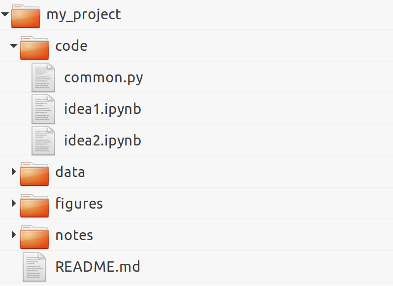

[*Chapter 2 : Best practices in Interactive Computing*](./)
[*第二章：交互计算之最佳实践*](../)

# 2.6. Ten tips for conducting reproducible interactive computing experiments
# 2.6. 进行可重复交互计算实验的十个技巧

In this recipe, we present ten tips that can help you conduct efficient and reproducible interactive computing experiments. These are more guidelines than absolute rules.
在这个参考手册中，我们提供了十个技巧，可以帮助你进行高效、可重复的交互计算实验。这些与其说是绝对的规则，不如说是指导方针。

First, we will show how you can improve your productivity by minimizing the time spent doing repetitive tasks and maximizing the time spent thinking about your core work.
首先，我们将展示如何通过最小化重复任务的时间和最大化思考核心工作的时间来提高工作效率。

Second, we will demonstrate how you can achieve more reproducibility in your computing work. Notably, academic research requires experiments to be reproducible so that any result or conclusion can be verified independently by other researchers. It is not uncommon for errors or manipulations in methods to result in erroneous conclusions that can have damaging consequences. For example, in the 2010 research paper in economics *Growth in a Time of Debt*, by Carmen Reinhart and Kenneth Rogoff, computational errors were partly responsible for a flawed study with global ramifications for policy makers (see https://en.wikipedia.org/wiki/Growth_in_a_Time_of_Debt).
其次，我们将演示如何在计算工作中获得更多的可重复性。值得注意的是，学术研究需要实验的可重复性，这样任何结果或结论都可以被其他研究者独立地验证。在方法上的错误或操作导致错误的结论并可能造成破坏性后果的情况并不少见。例如，卡门•莱因哈特(Carmen Reinhart)和肯尼斯•罗格夫(Kenneth Rogoff)在2010年发表的《经济增长在债务时期》(economics *Growth in a Time of Debt)研究报告中指出，计算错误是一项有缺陷的研究的部分原因，它对政策制定者具有全球性影响(见https://en.wikipedia.org/wiki/Growth_in_a_Time_of_Debt)。

## How to do it...
## 怎么做...

1. Organize your directory structure carefully and coherently. The specific structure does not matter. What matters is to be consistent throughout your projects regarding file-naming conventions, folders, subfolders, and so on. Here is a simple example:
1. 仔细和连贯地组织您的目录结构。具体的结构并不重要。重要的是在整个项目中保持文件命名约定、文件夹、子文件夹等方面的一致性。下面是一个简单的例子：

2. Write notes in text files using a lightweight markup language such as **Markdown** (http://daringfireball.net/projects/markdown/), **CommonMark** (http://commonmark.org/), or **reStructuredText (reST)**. All meta-information related to your project, files, data sets, code, figures, lab notebooks, and so on, should be written down in text files.
2. 使用轻量级标记语言(如**Markdown**(http：/daringFireball.net/projects/markdown/)、**CommonMark**(http：/Commonmark.org/)或**reStrercredText(REST)**)在文本文件中编写注释。所有与您的项目、文件、数据集、代码、数字、实验室NoteBook等相关的元信息都应该写在文本文件中。
3. Relatedly, document everything non-trivial in your code with comments, docstrings, and so on. You can use a documentation tool such as **Sphinx** (http://sphinx-doc.org). However, do not spend too much time documenting unstable and bleeding-edge code while you are working on it; it might change frequently and your documentation may soon be out of date. Write your code in such a way that it's easily understandable without comments (name your variables and functions well, use Pythonic patterns, and so on). See also the next recipe, *Write high-quality Python code*.
3. 相应地，用注释、文档字符串等文档记录代码中的所有重要内容。您可以使用**Sphinx**这样的文档工具(http://sphinx-doc.org)。但是，不要在编写不稳定的和前沿的代码时花费太多时间;它可能经常更改，您的文档可能很快就会过时。以一种无需注释就可以理解的方式编写代码(好的命名变量和函数，使用python模式，等等)。参见下一个参考手册**编写高质量的Python代码**。
4. Use a version control system such as Git for all text-based files, but not binary files (except maybe for very small ones when you really need to). You should use one repository per project. Synchronize the repositories on a remote server, using a free or paid hosting provider (such as GitHub, Gitlab, or Bitbucket) or your own server (your host institution might be able to set up one for you). Use a specific system to store and share binary data files, such as http://figshare.com or http://datadryad.org.
4. 对所有基于文本的文件使用Git之类的版本控制系统，但不要使用二进制文件(除非是非常小的文件，因为您确实需要)。每个项目应该使用一个存储库。使用免费或付费的托管提供者(如GitHub、Gitlab或Bitbucket)或您自己的服务器(您的宿主机构可能可以为您设置一个)同步远程服务器上的存储库。使用特定的系统存储和共享二进制数据文件，例如http://figshare.com或http://datadryad.org。
5. Write all your interactive computing code in Jupyter notebooks first and refactor it into standalone Python components only when it is sufficiently mature and stable.
5. 首先在Jupyter Notebook中编写所有交互式计算代码，只有当它足够成熟和稳定时，才将其重构为独立的Python组件。
6. Make sure that you record the exact versions of all components in your entire software stack (operating system, Python distribution, modules, and so on). A possibility is to use virtual environments with **virtualenv** or **conda**. Another possibility is to use **Docker** (https://www.docker.com).
6. 确保您记录了整个软件堆栈中所有组件的确切版本(操作系统、Python发行版、模块等等)。一种可能是使用带有**virtualenv**或**conda**的虚拟环境。另一种可能是使用**Docker** (https://www.docker.com)。
7. Cache long-to-compute intermediary results using Python's native **pickle** module, **dill** (https://github.com/uqfoundation/dill), or **Joblib** (http://pythonhosted.org/joblib/). Joblib notably implements a NumPy-aware **memoize** pattern (not to be confused with memorize), which allows you to cache the results of computationally intensive functions.
7. 使用Python的本机**pickle**模块，**dill** (https://github.com/uqfoundation/dill)或**Joblib** (http://pythonhosted.org/joblib/)缓存长到计算的中间结果。Joblib明显地实现了一个支持数字的**memoize**模式(不要与记忆混淆)，它允许您缓存计算密集型函数的结果。

> How to save persistent data in Python? For purely internal purposes, you can use Joblib, NumPy's `save()` and `savez()` functions for arrays, and `pickle` for any other Python object (prefer native types such as lists and dictionaries rather than custom classes). For sharing purposes, prefer text files for small datasets (less than 10,000 points), for example, CSV for arrays, and JSON or YAML for highly structured data. For larger datasets, you can use HDF5 (see the *Manipulating large arrays with HDF5* recipe of *Chapter 4, Profiling and Optimization*).
> 如何用Python保存持久数据? 出于纯粹的内部目的，您可以为数组使用Jbusb、NumPy的`save()`和`savez()`函数，以及对任何其他Python对象使用`ching le`(更喜欢本机类型，例如列表和字典，而不是自定义类)。出于共享的目的，喜欢用于小型数据集的文本文件(小于10，000点)，例如，用于数组的CSV，对于高度结构化数据的JSON或YAML。对于更大的数据集，您可以使用HDF5(参见*第4章，分析和优化*中*使用HDF5操纵大数组)。

8. When developing and trying out algorithms on large data sets, run them and compare them on small portions of your data first, before moving to the full sets.
8. 在开发和试验大型数据集上的算法时，首先运行它们，并在数据的小部分上进行比较，然后再转到完整的数据集。
9. When running jobs in a batch, use parallel computing to take advantage of your multicore processing units, for example, with **ipyparallel**, Joblib, **dask** (https://dask.pydata.org/en/latest/), Python's multiprocessing package, or any other parallel computing library.
9. 在批处理中运行作业时，使用并行计算来利用多核处理单元，例如，使用**ipyparallel**、Joblib、**dask** (https://dask.pydata.org/en/latest/)、Python的多处理包或任何其他并行计算库。
10. Automate your work as much as possible with Python functions or scripts. Use command-line arguments for user-exposed scripts, but prefer Python functions over scripts when possible. On Unix systems, learn terminal commands to improve your productivity. For repetitive tasks on Windows or GUI-based systems, use automation tools such as **AutoHotKey** (http://www.autohotkey.com). Learn keyboard shortcuts in the programs you use a lot, or create your own shortcuts. Automatic steps are reproducible, manual steps are not.
10. 尽可能用Python函数或脚本自动化您的工作。对于用户公开的脚本使用命令行参数，但是如果可能的话，更喜欢Python函数而不是脚本。在Unix系统上，学习终端命令来提高您的工作效率。对于Windows或基于gui的系统上的重复任务，使用自动化工具，如**AutoHotKey** (http://www.autohotkey.com)。在你经常使用的程序中学习键盘快捷键，或者创建你自己的快捷键。自动步骤是可复制的，手动步骤则不然。

## How it works...
## 它是如何工作的.。

The tips given in this recipe ultimately aim to optimize your workflows, in terms of human time, computer time, and quality. Using coherent conventions and structure for your code makes it easier for you to organize your work. Documenting everything saves everyone's time, including (eventually) yours!
本参考手册中给出的建议最终旨在优化您的工作流程，从人力时间、计算机时间和质量方面考虑。为代码使用一致的约定和结构使您更容易组织工作。记录每件事都能节省每个人的时间，包括(最终)你的时间!

Using a distributed version control system with an online hosting service makes it easy for you to work on the same code base from multiple locations, without ever worrying about backups. As you can go back in time in your code, you have very little chance of unintentionally breaking it.
使用带有在线托管服务的分布式版本控制系统，您可以轻松地从多个位置处理相同的代码库，而不必担心备份问题。由于您可以在代码中回溯到以前，因此无意中破坏它的机会非常小。

The Jupyter Notebook is an excellent tool for reproducible interactive computing. It lets you keep a detailed record of your work. Also, the ease of use of the Jupyter Notebook ease of use means that you don't have to worry about reproducibility; just do all of your interactive work in notebooks, put them under version control, and commit regularly. Don't forget to refactor your code into independent reusable components.
Jupyter Notebook是再现交互式计算的优秀工具。它能让你详细记录你的工作。另外，使用Jupyter Notebook的易用性意味着你不必担心可重复性;只需在NoteBook上完成所有的交互工作，将它们置于版本控制之下，并定期提交。不要忘记将代码重构为独立的可重用组件。

Be sure to optimize the time you spend in front of your computer. When working on an algorithm, this cycle frequently happens: you do a slight modification, you launch the code, get the results, make another change, and so on and so forth. If you need to try out a lot of changes, you should ensure that the execution time is fast enough (no more than a few seconds). Using advanced optimization techniques is not necessarily the best option at this stage of experimentation. You should cache your results, try out your algorithms on data subsets, and run your simulations with shorter durations. You can also launch batch jobs in parallel when you want to test different parameter values.
一定要优化你花在电脑前的时间。在处理算法时，这个循环经常发生:您进行了轻微的修改，启动代码，获得结果，进行另一次更改，等等。如果您需要尝试许多更改，您应该确保执行时间足够快(不超过几秒钟)。在这个实验阶段，使用高级优化技术不一定是最好的选择。您应该缓存您的结果，在数据子集上试用您的算法，并以较短的持续时间运行您的模拟。当您想要测试不同的参数值时，您还可以并行地启动批处理作业。

Finally, desperately try to avoid doing repetitive tasks. It is worth spending time automating such tasks when they occur frequently in your day-to-day work. It is more difficult to automate tasks that involve GUIs, but it is feasible thanks to free tools such as AutoHotKey.
最后，拼命避免做重复的工作。当这些任务在你的日常工作中频繁发生时，花时间将它们自动化是值得的。自动化涉及gui的任务更加困难，但由于有了AutoHotKey等免费工具，自动化任务是可行的。

## There's more...
## 还有更多...

Here are a few references:
以下是一些参考资料：

* Barbagroup reproducibility syllabus, at http://lorenabarba.com/blog/barbagroup-reproducibility-syllabus/
* Barbagroup再现性教学大纲, at http://lorenabarba.com/blog/barbagroup-reproducibility-syllabus/
* An efficient workflow for reproducible science, a talk by Trevor Bekolay, available at http://bekolay.org/scipy2013-workflow/.
* 一种可复制科学的高效工作流程，由特雷弗·贝科莱(Trevor Bekolay)撰写 at http://bekolay.org/scipy2013-workflow/.
* Ten Simple Rules for Reproducible Computational Research, Sandve et al., PLoS Computational Biology, 2013, available at http://dx.doi.org/10.1371/journal.pcbi.1003285.
* 可重复计算研究的十个简单规则，Sandve等人，PLoS计算生物学，2013年，可用 at http://dx.doi.org/10.1371/journal.pcbi.1003285.
* Software Carpentry, a volunteer organization running workshops for scientists; the workshops cover scientific programming, interactive computing, version control, testing, reproducibility, and task automation. You can find more information at http://software-carpentry.org.
* 软件木工，一个为科学家举办研讨会的志愿者组织;这些研讨会涵盖了科学编程、交互式计算、版本控制、测试、重现性和任务自动化。你可以找到更多的信息 at http://software-carpentry.org.
* Reproducible Science, at https://reproduciblescience.org/
* 可复制的科学， at https://reproduciblescience.org/

## See also
## 另请参阅

* Learning the basics of the Unix shell
* 学习Unix shell的基础知识
* Efficient interactive computing workflows with IPython
* 基于IPython的高效交互计算工作流
* Writing high-quality Python code
* 编写高质量的Python代码
