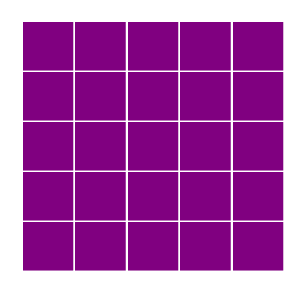
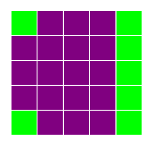
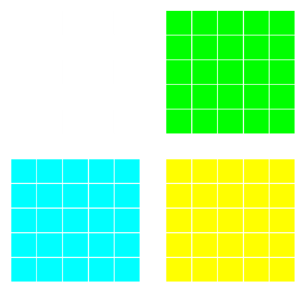
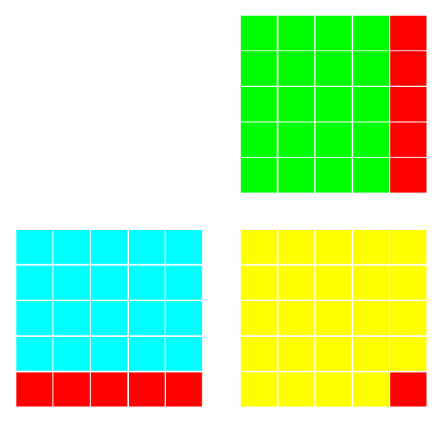

[*Chapter 3 : Mastering the Jupyter Notebook*](./)
[*第三章：掌握Jupyter Notebook*](./)

# 3.1. Teaching programming in the Notebook with IPython blocks
# 3.1. 使用IPython块在NoteBook中进行编程教学

The Jupyter Notebook is not only a tool for scientific research and data analysis but also a great tool for teaching. In this recipe, we show a simple and fun Python library for teaching programming notions: **IPython Blocks** (available at http://ipythonblocks.org). This library allows you or your students to create grids of colorful blocks. You can change the color and size of individual blocks, and you can even animate your grids. There are many basic technical notions you can illustrate with this tool. The visual aspect of this tool makes the learning process more effective and engaging.
Jupyter Notebook不仅是科学研究和数据分析的工具，也是一个很好的教学工具。在这个参考手册中，我们展示了一个简单而有趣的Python库，用于教授编程概念:**IPython Blocks**(可以在http://ipythonblocks.org上找到)。这个库允许你或你的学生创建彩色方块网格。你可以改变单个块的颜色和大小，甚至可以让你的网格动起来。有许多基本的技术概念可以用这个工具来说明。这个工具视觉方面的特性使学习过程更有效和有吸引力。

In this recipe, we will notably perform the following tasks:
在此参考手册中，我们将特别执行以下任务：

* Illustrate matrix multiplication with an animation
* 用动画演示矩阵乘法
* Display an image as a block grid
* 以块网格的形式显示图像

## Getting ready
## 准备工作

To install IPython Blocks, type `pip install ipythonblocks` in a terminal.
若要安装IPython块，请在终端中键入`pip install ipythonblock`。

## How to do it...
## 怎么做...

1. First, we import some modules as follows:
1. 首先，我们导入了如下模块：

```python
import time
from IPython.display import clear_output
from ipythonblocks import BlockGrid, colors
```

2. Now, we create a block grid with five columns and five rows, and we fill each block in purple:
2. 现在，我们创建一个包含五列和五行的块网格，并以紫色填充每个块：

```python
grid = BlockGrid(width=5, height=5,
                 fill=colors['Purple'])
grid.show()
```



3. We can access individual blocks with 2D indexing. This illustrates the indexing syntax in Python. We can also access an entire row or line with a `:` (colon). Each block is represented by an RGB color. The library comes with a handy dictionary of colors, assigning RGB tuples to standard color names as follows:
3. 我们可以使用2D索引访问各个块。这说明了Python中的索引语法。我们还可以使用`:`(冒号)访问整个行或行。每个块用RGB颜色表示。库附带了一个方便的颜色字典，将RGB元组分配给标准颜色名称如下：

```python
grid[0, 0] = colors['Lime']
grid[-1, 0] = colors['Lime']
grid[:, -1] = colors['Lime']
grid.show()
```



4. Now, we are going to illustrate matrix multiplication. We will represent two `(n, n)` matrices, `A` (in cyan) and `B` (lime) aligned with `C = A B` (yellow). To do this, we use a small trick of creating a big white grid of size `(2n+1, 2n+1)`. The matrices `A`, `B`, and `C` are just views on parts of the grid.
4. 现在，我们将演示矩阵乘法。我们将代表两个`(n，n)`矩阵，`A`(青色)和`B`(石灰)与`C=A B`(黄色)对齐。要做到这一点，我们使用一个小技巧，创建一个大的白色网格的大小`(2n+1，2n+1)`。矩阵`A`、`B`和`C`只是网格部分的视图。

```python
n = 5
grid = BlockGrid(width=2 * n + 1,
                 height=2 * n + 1,
                 fill=colors['White'])
A = grid[n + 1:, :n]
B = grid[:n, n + 1:]
C = grid[n + 1:, n + 1:]
A[:, :] = colors['Cyan']
B[:, :] = colors['Lime']
C[:, :] = colors['Yellow']
grid.show()
```



5. Let's turn to matrix multiplication itself. We perform a loop over all rows and columns, and we highlight the corresponding rows and columns in A and B that are multiplied together during the matrix product. We combine IPython's `clear_output()` method with `grid.show()` and `time.sleep()` (pause) to implement the animation as follows:
5. 我们来看看矩阵乘法本身。我们对所有行和列执行循环，并突出显示A和B中相应的行和列，它们在矩阵乘积中相乘。我们将IPython的`clear_output()`方法与`grid.show()`和`time.sleep()`(pause)相结合，实现如下动画:

```python
for i in range(n):
    for j in range(n):
        # We reset the matrix colors.
        A[:, :] = colors['Cyan']
        B[:, :] = colors['Lime']
        C[:, :] = colors['Yellow']
        # We highlight the adequate rows
        # and columns in red.
        A[i, :] = colors['Red']
        B[:, j] = colors['Red']
        C[i, j] = colors['Red']
        # We animate the grid in the loop.
        clear_output()
        grid.show()
        time.sleep(.25)
```



6. Finally, we will display an image with IPython Blocks. We download and import a PNG image with `matplotlib` and we retrieve the data as follows:
6. 最后，我们将使用IPython块显示一个图像。我们用`matplotlib`下载并导入一副PNG图像，并检索数据如下：

```python
# We downsample the image by a factor of 4 for
# performance reasons.
img = plt.imread('https://github.com/ipython-books/'
                 'cookbook-2nd-data/blob/master/'
                 'beach.png?raw=true')[::4, ::4, :]
```

```python
rgb = [img[..., i].ravel() for i in range(3)]
```

7. Now, we create a `BlockGrid` instance with the appropriate number of rows and columns, and we set each block's color to the corresponding pixel's color in the image (multiplying by 255 to convert from a floating-point number in `[0, 1]` into an 8-bit integer). We use a small block size, and we remove the lines between the blocks as follows:
7. 现在，我们创建一个具有适当行数和列数的`BlockGrid`实例，并将每个块的颜色设置为图像中相应像素的颜色(乘以255，将从`[0，1]`中的浮点数转换为8位整数)。我们使用一个较小的块大小，并删除了块之间的线如下:

```python
height, width = img.shape[:2]
grid = BlockGrid(width=width, height=height,
                 block_size=2, lines_on=False)
for block, r, g, b in zip(grid, *rgb):
    block.rgb = (r * 255, g * 255, b * 255)
grid.show()
```


