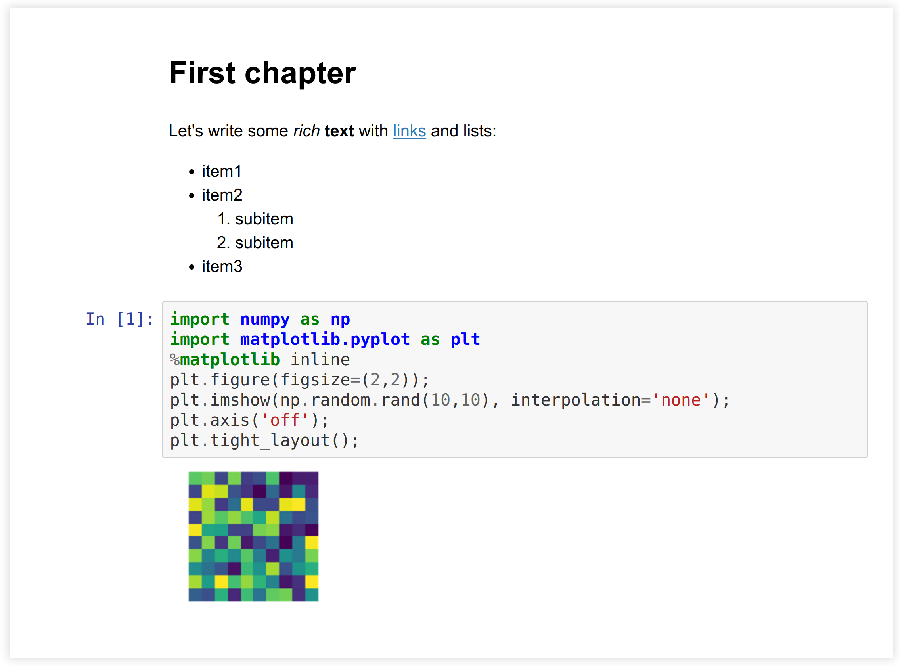
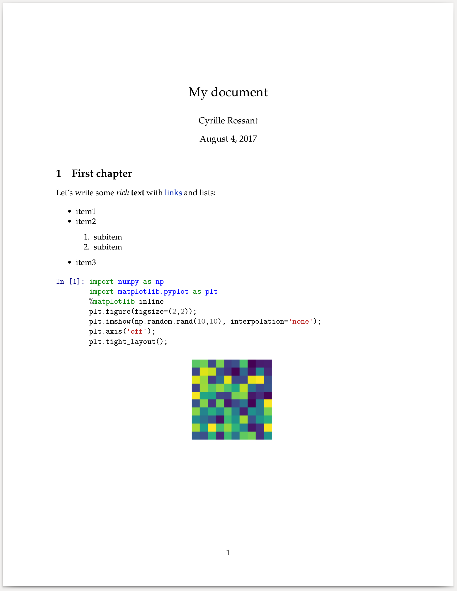

[*Chapter 3 : Mastering the Jupyter Notebook*](./)
[*第三章：掌握Jupyter Notebook*](./)

# 3.2. Converting a Jupyter notebook to other formats with nbconvert
# 3.2. 用nbconvert将Jupyter Notebook转换为其他格式

A Jupyter notebook is saved in a JSON text file. This file contains the entire contents of the notebook: text, code, and outputs. The matplotlib figures are encoded as base64 strings within the notebooks, resulting in standalone, but sometimes big, notebook files.
一个Jupyter Notebook保存在一个JSON文本文件中。此文件包含NoteBook的全部内容：文本、代码和输出。matplotlib图形在NoteBook中被编码为base 64字符串，从而生成独立但有时很大的NoteBook文件。

> JSON is a human-readable, text-based, open standard format that can represent structured data. Although derived from JavaScript, it is language independent. Its syntax bears some resemblance with Python dictionaries. JSON can be parsed in many languages including JavaScript and Python (using the `json` module in Python's standard library).
> JSON是一种人类可读的、基于文本的、开放的标准格式，可以表示结构化数据.虽然它来自JavaScript，但它与语言无关。它的语法与Python字典有一些相似之处。JSON可以用许多语言进行解析，包括JavaScript和Python(使用Python标准库中的`json`模块)。

**nbconvert** (https://nbconvert.readthedocs.io/en/stable/) is a tool that can convert notebooks to other formats: raw text, Markdown, HTML, LaTeX/PDF, and even slides with the reveal.js library. You will find more information about the different supported formats on the nbconvert documentation.
**nbConvert**(https://nbconvert.readthedocs.io/en/stable/)是一个工具，可以将NoteBook转换成其他格式：原始文本、Markdown、HTML、LaTeX/PDF，甚至还可以使用replal.js库进行幻灯片转换。您将在nbConvert文档中找到有关不同支持格式的更多信息。

One typically uses the **nbformat** (https://nbformat.readthedocs.io/en/latest/) library to manipulate a notebook. However, in this recipe, we will see how to manipulate the contents of a notebook (which is just a plain text JSON file) directly with Python, and how to convert it to other formats with nbconvert.
通常使用**nbformat** (https://nbformat.readthedocs.io/en/latest/)库来操作NoteBook。然而，在这个参考手册中，我们将看到如何使用Python直接操作NoteBook(它只是一个纯文本JSON文件)的内容，以及如何使用nbconvert将其转换为其他格式。

## Getting ready
## 准备工作

You need to install pandoc, available at http://pandoc.org. This tool is used to convert markup files to various formats. On Ubuntu, type `sudo apt-get install pandoc` in a terminal.
您需要安装pandoc，可以访问http://pandoc.org。此工具用于将markup文件转换为各种格式。在Ubuntu上，在终端输入`sudo apt-get安装pandoc`。

To convert a notebook to PDF, you need a LaTeX distribution, which you can download and install at http://latex-project.org/ftp.html.
要将NoteBook转换为PDF，您需要一个LaTeX发行版，您可以从http://latex project.org/ftp.html下载和安装它。

## How to do it...
## 怎么做...

1. Let's download and open the test notebook. A notebook is just a plain text file (JSON):
1. 让我们下载并打开测试NoteBook。NoteBook只是一个纯文本文件(JSON):

```python
import io
import requests
```

```python
url = ('https://github.com/ipython-books/'
       'cookbook-2nd-data/blob/master/'
       'test.ipynb?raw=true')
```

```python
contents = requests.get(url).text
print(len(contents))
```

```{output:stdout}
3857
```

2. Here is an excerpt of the `test.ipynb` file:
2. 下面是`test.ipynb`文件的摘录：

```python
print(contents[:345] + '...' + contents[-33:])
```

```{output:stdout}
{
 "cells": [
  {
   "cell_type": "markdown",
   "metadata": {},
   "source": [
    "# First chapter"
   ]
  },
  {
   "cell_type": "markdown",
   "metadata": {
    "my_field": [
     "value1",
     "2405"
    ]
   },
   "source": [
    "Let's write some *rich* **text** with
        [links](http://www.ipython.org) and lists:\n",
    "\n",
    "* item1...rmat": 4,
 "nbformat_minor": 4
}
```

3. Now that we have loaded the notebook in a string, let's parse it with the `json` module as follows:
3. 现在我们已经将NoteBook加载到一个字符串中，让我们用`json`模块解析它，如下所示：

```python
import json
nb = json.loads(contents)
```

4. Let's have a look at the keys in the notebook dictionary:
4. 让我们看看NoteBook字典里的键:

```python
print(nb.keys())
print('nbformat %d.%d' % (nb['nbformat'],
                          nb['nbformat_minor']))
```

```{output:stdout}
dict_keys(['cells', 'metadata',
           'nbformat', 'nbformat_minor'])
nbformat 4.4
```

5. Each cell has a type, optional metadata, some contents (text or code), possibly one or several outputs, and other information. Let's look at a Markdown cell and a code cell:
5. 每个单元格都有一个类型、可选元数据、一些内容(文本或代码)、一个或几个输出以及其他信息。让我们看一下标记单元格和代码单元格：

```python
nb['cells'][1]
```

```{output:result}
{'cell_type': 'markdown',
 'metadata': {'my_field': ['value1', '2405']},
 'source': ["Let's write some *rich* **text** with
        [links](http://www.ipython.org) and lists:\n",
  '\n',
  '* item1\n',
  '* item2\n',
  '    1. subitem\n',
  '    2. subitem\n',
  '* item3']}
```

```python
nb['cells'][2]
```

```{output:result}
{'cell_type': 'code',
 'execution_count': 1,
 'metadata': {},
 'outputs': [{'data': {'image/png': 'iVBOR...QmCC\n',
    'text/plain': ['<matplotlib Figure at ...>']},
   'metadata': {},
   'output_type': 'display_data'}],
 'source': ['import numpy as np\n',
  'import matplotlib.pyplot as plt\n',
  '%matplotlib inline\n',
  'plt.figure(figsize=(2,2));\n',
  "plt.imshow(np.random.rand(10,10),
              interpolation='none');\n",
  "plt.axis('off');\n",
  'plt.tight_layout();']}
```

6. Once parsed, the notebook is represented as a Python dictionary. Manipulating it is therefore quite convenient in Python. Here, we count the number of Markdown and code cells as follows:
6. 一旦被解析，NoteBook就被表示为Python字典。因此，在Python中操作它非常方便。在这里，我们按以下方式计算标记和代码单元格的数量：

```python
cells = nb['cells']
nm = len([cell for cell in cells
          if cell['cell_type'] == 'markdown'])
nc = len([cell for cell in cells
          if cell['cell_type'] == 'code'])
print((f"There are {nm} Markdown cells and "
       f"{nc} code cells."))
```

```{output:stdout}
There are 2 Markdown cells and 1 code cells.
```

7. Let's have a closer look at the image output of the cell with the matplotlib figure:
7. 让我们用matplotlib图更仔细地查看单元格的图像输出:

```python
cells[2]['outputs'][0]['data']
```

```{output:result}
{'image/png': 'iVBOR...QmCC\n',
 'text/plain': ['<matplotlib.figure.Figure at ...>']}
```

In general, there can be zero, one, or multiple outputs. Additionally, each output can have multiple representations. Here, the matplotlib figure has a PNG representation (the base64-encoded image) and a text representation (the internal representation of the figure).
通常，可以有0、1或多个输出。此外，每个输出可以有多个表示。在这里，matplotlib图有一个png表示(base 64编码的图像)和一个文本表示(图形的内部表示)。
8. Now, we convert our text notebook to HTML using nbconvert:
8. 现在，我们使用nbconvert将我们的文本NoteBook转换为HTML:

```python
# We write the notebook to a file on disk.
with open('test.ipynb', 'w') as f:
    f.write(contents)
```

```python
!jupyter nbconvert --to html test.ipynb
```

```{output:stdout}
[NbConvertApp] Converting notebook test.ipynb to html
[NbConvertApp] Writing 253784 bytes to test.html
```

9. Let's display this document in an `<iframe>` (a small window showing an external HTML document within the notebook):
9. 让我们在`<iframe>`(在NoteBook中显示外部HTML文档的一个小窗口)中显示这个文档：

```python
from IPython.display import IFrame
IFrame('test.html', 600, 200)
```



10. We can also convert the notebook to LaTeX and PDF. In order to specify the title and author of the document, we need to extend the default LaTeX template. First, we create a file called `temp.tplx` that extends the default `article.tplx` template provided by nbconvert. We specify the contents of the author and title blocks as follows:
10. 我们也可以把NoteBook转换成乳胶和PDF。为了指定文档的标题和作者，我们需要扩展默认的LaTeX模板。首先，我们创建了一个名为`tem.tplx`的文件，它扩展了nbConvert提供的默认的`tracle.tplx`模板。我们将作者和标题块的内容指定如下：

```python
%%writefile temp.tplx
((*- extends 'article.tplx' -*))

((* block author *))
\author{Cyrille Rossant}
((* endblock author *))

((* block title *))
\title{My document}
((* endblock title *))
```

```{output:stdout}
Writing temp.tplx
```

11. Then, we can run nbconvert by specifying our custom template as follows:
11. 然后，我们可以通过如下所示的自定义模板来运行nbConvert：

```python
%%bash
jupyter nbconvert --to pdf --template temp test.ipynb
```

```{output:stderr}
[NbConvertApp] Converting notebook test.ipynb to pdf
[NbConvertApp] Support files will be in test_files/
[NbConvertApp] Making directory test_files
[NbConvertApp] Writing 16695 bytes to notebook.tex
[NbConvertApp] Building PDF
[NbConvertApp] Running xelatex 3 times:
    ['xelatex', 'notebook.tex']
[NbConvertApp] Running bibtex 1 time:
    ['bibtex', 'notebook']
[NbConvertApp] PDF successfully created
[NbConvertApp] Writing 16147 bytes to test.pdf
```

We used nbconvert to convert the notebook to LaTeX, and pdflatex (coming with our LaTeX distribution) to compile the LaTeX document to PDF. The following screenshot shows the PDF version of the notebook:
我们使用nbconvert将NoteBook转换为LaTeX，而使用pdflatex(与LaTeX发行版一起提供)将LaTeX文档编译为PDF。下面的截图显示了这个NoteBook的PDF版本:



## How it works...
## 它是如何工作的.。

As we have seen in this recipe, an `.ipynb` file contains a structured representation of the notebook. This JSON file can be easily parsed and manipulated in Python and other languages. However, it is better practice to use the **nbformat** package to manipulate a notebook. The internal JSON format may change, whereas the nbformat API is not expected to change.
正如我们在这个参考手册中所看到的，`.ipynb`文件包含NoteBook的结构化表示。这个JSON文件可以很容易地用Python和其他语言进行解析和操作。然而，更好的做法是使用**nbformat**包来操作NoteBook。内部JSON格式可能会改变，而nbFormat API则不会改变。

nbconvert is a tool for converting a notebook to another format. The conversion can be customized in several ways. Here, we extended an existing template using jinja2, a templating package (see http://jinja.pocoo.org/docs/).
nbConvert是一种将NoteBook转换成另一种格式的工具。转换可以通过多种方式进行定制。在这里，我们使用一个模板包Jinja2扩展了一个现有的模板(请参阅http://jinja.pocoo.org/docs/).

## There's more...
## 还有更多...

There is a free online service, **nbviewer**, that lets us render Jupyter notebooks in HTML dynamically in the cloud. The idea is that we provide to nbviewer a URL to a raw notebook (in JSON), and we get a rendered HTML output. The main page of nbviewer (http://nbviewer.jupyter.org/) contains a few examples. This service is maintained by the Jupyter developers and is hosted on Rackspace (https://www.rackspace.com).
有一个免费的在线服务，**nbview**，它允许我们在云平台中动态地以HTML呈现Jupyter Notebook。我们的想法是向nbview提供一个指向原始NoteBook的URL(在JSON中)，并得到一个呈现出来的HTML输出。nbview的主页(http://nbviewer.jupyter.org/)包含一些示例。此服务由Jupyter开发人员维护，并托管在Rackspace(https://www.rackspace.com)上。

GitHub automatically renders Jupyter notebooks stored in repositories.
GitHub自动呈现存储在存储库中的Jupyter Notebook。

**binder**, available at https://mybinder.org, allows one to turn a GitHub repository into a collection of interactive notebooks in the cloud. The service is free and the code is open source, so that anyone can provide their own binder service.
可以在https://mybinder.org上找到binder，它允许我们将GitHub存储库转换成云中交互式NoteBook的集合。该服务是免费的，代码是开源的，因此任何人都可以提供自己的活页夹服务。

Here are some more references:
以下是一些参考资料:

* Documentation of nbconvert, at https://nbconvert.readthedocs.io/en/stable/
* RISE, create interactive slideshows out of Jupyter notebooks, at https://damianavila.github.io/RISE/
