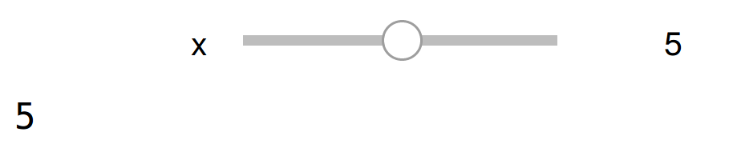
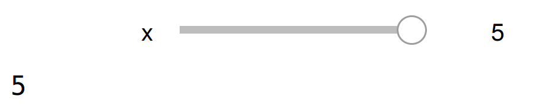
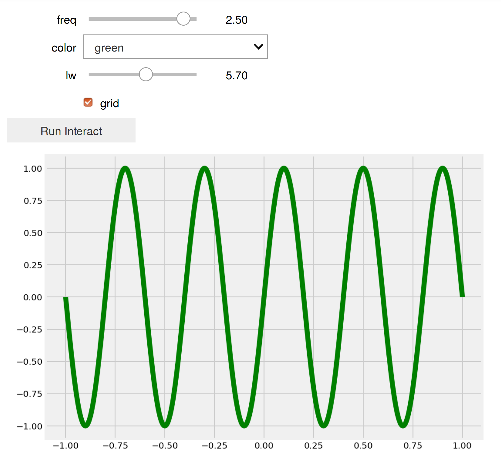
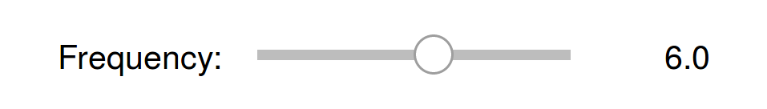
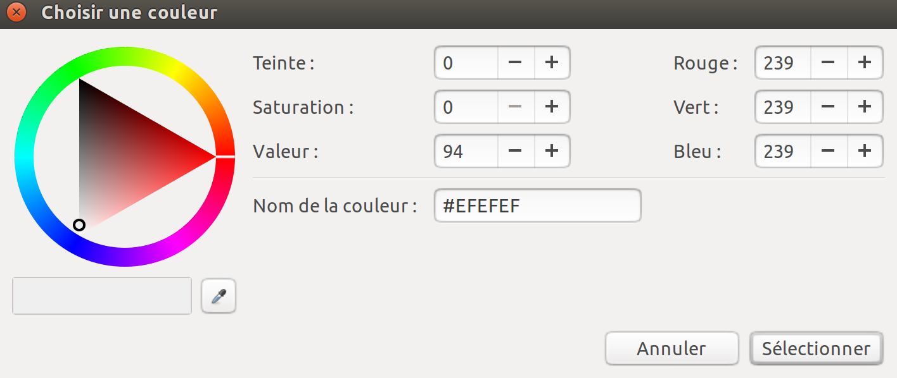
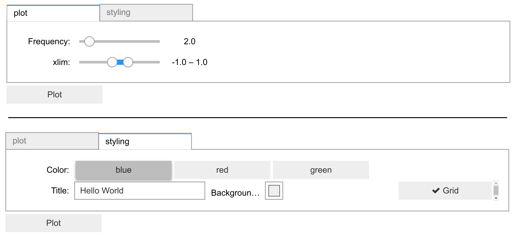

[*Chapter 3 : Mastering the Jupyter Notebook*](./)
[*第三章：掌握Jupyter Notebook*](./)

# 3.3. Mastering widgets in the Jupyter Notebook
# 3.3. 掌握Jupyter Notebook中的小部件

The **ipywidgets** package provides many common user interface controls for exploring code and data interactively. These controls can be assembled and customized to create complex graphical user interfaces. In this recipe, we introduce the various ways we can create user interfaces with ipywidgets.
**ipywidgets**包提供了许多通用的用户界面控件，用于交互式地研究代码和数据。可以组装和定制这些控件，以创建复杂的图形用户界面。在这个参考手册中，我们将介绍使用ipywidgets创建用户界面的各种方法。

## Getting ready
## 准备工作

The ipywidgets package should be installed by default in Anaconda, but you can also install it manually with `conda install ipywidgets`.
默认情况下，应该在Anaconda中安装ipywidget包，但您也可以使用`conda install ipywidgets`手动安装它。

Alternatively, you can install ipywidgets with `pip install ipywidgets`, but then you also need to type the following command in order to enable the extension in the Jupyter Notebook:
或者，您可以使用`pip install ipywidgets`安装ipywidgets，但是您还需要输入以下命令，以便在Jupyter Notebook中启用扩展:

```bash
jupyter nbextension enable --py --sys-prefix widgetsnbextension
```

## How to do it...
## 怎么做...

1. Let's import the packages:
1. 让我们导入这些包:

```python
import ipywidgets as widgets
from ipywidgets import HBox, VBox
import numpy as np
import matplotlib.pyplot as plt
from IPython.display import display
%matplotlib inline
```

2. The `@interact` decorator shows a widget for controlling the arguments of a function. Here, the function `f()` accepts an integer as an argument. By default, the `@interact` decorator displays a slider to control the value passed to the function:
2. `@interact`装饰符显示了一个小部件，用于控制函数的参数。在这里，函数`f()`接受一个整数作为参数。默认情况下，`@interact‘装饰器显示一个滑块来控制传递给函数的值：

```python
@widgets.interact
def f(x=5):
    print(x)
```



The function `f()` is called whenever the slider value changes.
每当滑块值发生变化时，都会调用函数`f()`。

3. We can customize the slider parameters. Here, we specify a minimum and maximum integer range for the slider:
3. 我们可以定制滑块参数。这里，我们为滑块指定一个最小和最大整数范围:

```python
@widgets.interact(x=(0, 5))
def f(x=5):
    print(x)
```



4. There is also an `@interact_manual` decorator which provides a button to call the function manually. This is useful with long-lasting computations that should not run every time a widget value changes. Here, we create a simple user interface for controlling four parameters of a function that displays a plot. There are two floating-point sliders, a dropdown menu for choosing a value among a few predefined options, and a checkbox for boolean values:
4. 还有一个`@Interactive_manual‘装饰符，它提供了一个按钮来手动调用函数。对于不应该每次小部件值更改时运行的长时间计算来说，这是非常有用的。在这里，我们创建了一个简单的用户界面，用于控制显示一个图的函数的四个参数。有两个浮点滑块，一个下拉菜单，用于在几个预定义的选项中选择一个值，以及一个用于布尔值的复选框：

```python
@widgets.interact_manual(
    color=['blue', 'red', 'green'], lw=(1., 10.))
def plot(freq=1., color='blue', lw=2, grid=True):
    t = np.linspace(-1., +1., 1000)
    fig, ax = plt.subplots(1, 1, figsize=(8, 6))
    ax.plot(t, np.sin(2 * np.pi * freq * t),
            lw=lw, color=color)
    ax.grid(grid)
```



5. In addition to the `@interact` and `@interact_manual` decorators, ipywidgets provides a simple API to create individual widgets. Here, we create a floating-point slider:
5. 除了`@interact`和`@interactivemanual`装饰器之外，ipywidget还提供了一个简单的API来创建各个小部件。在这里，我们创建了一个浮点滑块：

```python
freq_slider = widgets.FloatSlider(
    value=2.,
    min=1.,
    max=10.0,
    step=0.1,
    description='Frequency:',
    readout_format='.1f',
)
freq_slider
```



6. Here is an example of slider for selecting pairs of numbers, like intervals and ranges:
6. 下面是选择数字对的滑块示例，比如间隔和范围:

```python
range_slider = widgets.FloatRangeSlider(
    value=[-1., +1.],
    min=-5., max=+5., step=0.1,
    description='xlim:',
    readout_format='.1f',
)
range_slider
```


7. The toggle button can control a boolean value:
7. 切换按钮可以控制一个布尔值:

```python
grid_button = widgets.ToggleButton(
    value=False,
    description='Grid',
    icon='check'
)
grid_button
```


8. Dropdown menus and toggle buttons are useful when selecting a value among a predefined set of options:
8. 下拉菜单和切换按钮在从预定义的选项中选择值时非常有用：

```python
color_buttons = widgets.ToggleButtons(
    options=['blue', 'red', 'green'],
    description='Color:',
)
color_buttons
```


9. The text widget allows the user to write a string:
9. 文本小部件允许用户编写字符串:

```python
title_textbox = widgets.Text(
    value='Hello World',
    description='Title:',
)
title_textbox
```


10. We can let the user choose a color using the built-in system color picker:
10. 我们可以让用户使用内置的系统颜色选择器选择颜色:

```python
color_picker = widgets.ColorPicker(
    concise=True,
    description='Background color:',
    value='#efefef',
)
color_picker
```



11. We can also simply create a button:
11. 我们也可以简单地创建一个按钮:

```python
button = widgets.Button(
    description='Plot',
)
button
```


12. Now, we will see how to combine these widgets into a complex graphical user interface, and how to react to user interactions with these controls. We create a function that will display a plot as defined by the created controls. We can access the control value with the `value` property of the widgets:
12. 现在，我们将看到如何将这些小部件组合成复杂的图形用户界面，以及如何对与这些控件的用户交互作出反应。我们创建一个函数来显示由创建的控件定义的绘图。我们可以使用小部件的`value`属性访问控件值：

```python
def plot2(b=None):
    xlim = range_slider.value
    freq = freq_slider.value
    grid = grid_button.value
    color = color_buttons.value
    title = title_textbox.value
    bgcolor = color_picker.value

    t = np.linspace(xlim[0], xlim[1], 1000)
    f, ax = plt.subplots(1, 1, figsize=(8, 6))
    ax.plot(t, np.sin(2 * np.pi * freq * t),
            color=color)
    ax.grid(grid)
```

13. The `on_click` decorator of a button widget lets us react to click events. Here, we simply declare that the plotting function should be called when the button is pressed:
13. 按钮小部件的`on_click`装饰器允许我们对单击事件做出反应。在这里，我们简单地声明当按下按钮时应该调用绘图函数：

```python
@button.on_click
def plot_on_click(b):
    plot2()
```

14. To display all of our widgets in a unified graphical interface, we define a layout with two tabs. The first tab shows widgets related to the plot itself, whereas the second tab shows widgets related to the styling of the plot. Each tab contains a vertical stack of widgets defined with the `VBox` class:
14. 为了在统一的图形界面中显示所有小部件，我们定义了一个带有两个选项卡的布局。第一个选项卡显示与绘图本身相关的小部件，而第二个选项卡显示与绘图样式相关的小部件。每个选项卡都包含一个由`VBox`类定义的垂直部件堆栈:

```python
tab1 = VBox(children=[freq_slider,
                      range_slider,
                      ])
tab2 = VBox(children=[color_buttons,
                      HBox(children=[title_textbox,
                                     color_picker,
                                     grid_button]),
                                     ])
```

15. Finally, we create the `Tab` instance with our two tabs, we set the titles of the tabs, and we add the plot button below the tabs:
15. 最后，我们用两个选项卡创建`Tab‘实例，设置选项卡的标题，并在选项卡下面添加绘图按钮：

```python
tab = widgets.Tab(children=[tab1, tab2])
tab.set_title(0, 'plot')
tab.set_title(1, 'styling')
VBox(children=[tab, button])
```



## There's more...
## 还有更多...

The documentation of ipywidgets demonstrates many other features of the package. The styling of the widgets can be customized. New widgets can be created by writing Python and JavaScript code (see recipe *Creating custom Jupyter Notebook widgets in Python, HTML, and JavaScript*). Widgets can also remain at least partly functional in a static notebook export.
ipywidget的文档演示了包的许多其他特性。可以定制小部件的样式。可以通过编写Python和JavaScript代码来创建新的小部件(请参见用Python、HTML和JavaScript*创建定制的Jupyter Notebook小部件)。小部件还可以在静态NoteBook导出中至少部分保持功能。

Here are a few references:
以下是一些参考资料：

* ipywidgets user guide at https://ipywidgets.readthedocs.io/en/stable/user_guide.html
* ipywidgets用户指南 at https://ipywidgets.readthedocs.io/en/stable/user_guide.html
* Building a custom widget at https://ipywidgets.readthedocs.io/en/stable/examples/Widget%20Custom.html
* 构建自定义小部件 at https://ipywidgets.readthedocs.io/en/stable/examples/Widget%20Custom.html

## See also
## 另请参阅

* Creating custom Jupyter Notebook widgets in Python, HTML, and JavaScript
* 用Python、HTML和JavaScript创建定制的Jupyter Notebook小部件
