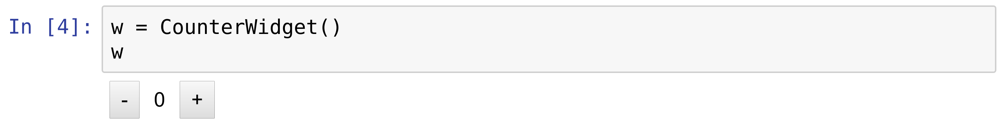
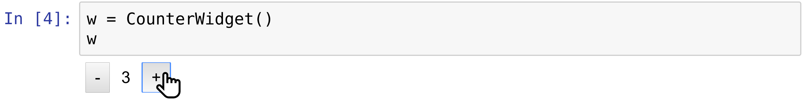
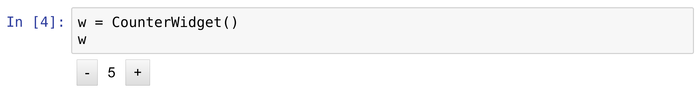

[*Chapter 3 : Mastering the Jupyter Notebook*](./)
[*第三章：掌握Jupyter Notebook*](./)

# 3.4. Creating custom Jupyter Notebook widgets in Python, HTML, and JavaScript
# 3.4. 用Python、HTML和JavaScript创建定制的Jupyter Notebook小部件

The ipywidgets packages provides many built-in control widgets to interact with code and data in the Jupyter Notebook. In this recipe, we show how to build a custom interactive widget from scratch, using Python on the kernel side, and HTML/JavaScript on the client side (frontend). The widget just displays two buttons to increase and decrease a number. The number can be accessed and updated either from the kernel (Python code) or the client (browser).
ipywidget包提供了许多内置的控件小部件，可以与Jupyter Notebook中的代码和数据进行交互。在这个参考手册中，我们将展示如何从头开始构建一个定制的交互式小部件，在内核端使用Python，在客户端(前端)使用HTML/JavaScript。小部件只显示两个按钮来增加和减少一个数字。可以从内核(Python代码)或客户机(浏览器)访问和更新数字。

## How to do it...
## 怎么做...

1. Let's import the packages:
1. 让我们导入包：

```python
import ipywidgets as widgets
from traitlets import Unicode, Int, validate
```

2. We create a `CounterWidget` class deriving from `DOMWidget`:
2. 我们创建了一个从`DOMWidget`派生出来的`CounterWidget`类：

```python
class CounterWidget(widgets.DOMWidget):
    _view_name = Unicode('CounterView').tag(sync=True)
    _view_module = Unicode('counter').tag(sync=True)
    value = Int(0).tag(sync=True)
```

This class represents the Python part of the widget. The `_view_name` and `_view_module` attributes refer to the name and module of the JavaScript part. We use the traitlets package to specify the type of the variables. The `value` attribute is the counter value, an integer initialized at 0. All of these attributes' values are synchronized between Python and JavaScript, hence the `sync=True` option.
这个类表示小部件的Python部分。`_view_name`和`_view_module`属性引用JavaScript部分的名称和模块。我们使用traitlet包来指定变量的类型。`value`属性是计数器值，初始化为整数0。所有这些属性的值都是在Python和JavaScript之间同步的，因此使用了`sync=True`选项。

3. We now turn to the JavaScript side of the widget. We can write the code directly in the notebook using the `%%javascript` cell magic. The widgets framework relies on several JavaScript libraries: jQuery (represented as the `$` variable), require.js (modules and dependencies), and Backbone.js (a model view controller framework):
3. 现在我们转到小部件的JavaScript端。我们可以使用`%%javascript` cell魔法在NoteBook中直接编写代码。小部件框架依赖于几个JavaScript库:jQuery(表示为`$`变量)、require.js(模块和依赖项)和Backbone.js(模型视图控制器框架)：

```python
%%javascript
// We make sure the `counter` module is defined
// only once.
require.undef('counter');

// We define the `counter` module depending on the
// Jupyter widgets framework.
define('counter', ["@jupyter-widgets/base"],
       function(widgets) {

    // We create the CounterView frontend class,
    // deriving from DOMWidgetView.
    var CounterView = widgets.DOMWidgetView.extend({

        // This method creates the HTML widget.
        render: function() {
            // The value_changed() method should be
            // called when the model's value changes
            // on the kernel side.
            this.value_changed();
            this.model.on('change:value',
                          this.value_changed, this);

            var model = this.model;
            var that = this;

            // We create the plus and minus buttons.
            this.bm = $('<button/>')
            .text('-')
            .click(function() {
                // When the button is clicked,
                // the model's value is updated.
                var x = model.get('value');
                model.set('value', x - 1);
                that.touch();
            });

            this.bp = $('<button/>')
            .text('+')
            .click(function() {
                var x = model.get('value');
                model.set('value', x + 1);
                that.touch();
            });

            // This element displays the current
            // value of the counter.
            this.span = $('<span />')
            .text('0')
            .css({marginLeft: '10px',
                  marginRight: '10px'});

            // this.el represents the widget's DOM
            // element. We add the minus button,
            // the span element, and the plus button.
            $(this.el)
            .append(this.bm)
            .append(this.span)
            .append(this.bp);
        },

        value_changed: function() {
            // Update the displayed number when the
            // counter's value changes.
            var x = this.model.get('value');
            $($(this.el).children()[1]).text(x);
        },
    });

    return {
        CounterView : CounterView
    };
});
```

4. Let's display the widget:
4. 让我们显示这个小部件：

```python
w = CounterWidget()
w
```



5. Pressing the buttons updates the value immediately.
5. 按下按钮将立即更新该值。



6. The counter's value is automatically updated on the kernel side:
6. 计数器的值在内核端自动更新：

```python
print(w.value)
```

```{output:stdout}
4
```

7. Conversely, we can update the value from Python, and it is updated in the frontend:
7. 相反，我们可以从Python中更新值，并且在前端更新:

```python
w.value = 5
```



## There's more...
## 还有更多...

Here are a few references:
以下是一些参考资料：

* Custom widget tutorial at https://ipywidgets.readthedocs.io/en/stable/examples/Widget%20Custom.html
* 自定义小部件教程 at https://ipywidgets.readthedocs.io/en/stable/examples/Widget%20Custom.html
* Require.js library at http://requirejs.org/
* Backbone.js library at http://backbonejs.org/
* Backbone.js库 at http://backbonejs.org/

## See also
## 另请参阅

* Mastering widgets in the Jupyter Notebook
* 掌握Jupyter Notebook中的小部件
