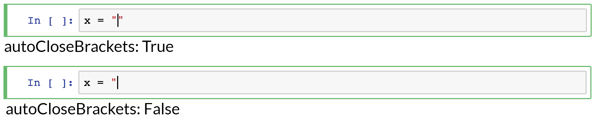

[*Chapter 3 : Mastering the Jupyter Notebook*](./)
[*第三章：掌握Jupyter Notebook*](./)

# 3.5. Configuring the Jupyter Notebook
# 3.5. 配置Jupyter Notebook

Many aspects of the Jupyter Notebook can be configured. We covered the configuration of the IPython kernel in Chapter 1, recipe *Mastering IPython's configuration system*. In this recipe, we show how to configure the Jupyter application and the Jupyter Notebook frontend.
Jupyter Notebook的许多方面都可以配置。我们在第1章`参考手册**掌握IPython的配置系统**`中介绍了IPython内核的配置。在这个参考手册中，我们展示了如何配置Jupyter应用程序和Jupyter Notebook前端。

## How to do it...
## 怎么做...

1. Let's check whether the Jupyter Notebook configuration file already exists:
1. 让我们检查Jupyter Notebook配置文件是否已经存在:

```python
%ls ~/.jupyter/jupyter_notebook_config.py
```

```{output:stdout}
~/.jupyter/jupyter_notebook_config.py
```

If it does not, type `!jupyter notebook --generate-config -y` in the notebook. If the file already exists, this command will delete its contents and replace it by the default file.
如果没有，则在NoteBook中键入`!jupyter notebook --generate-config -y`。如果文件已经存在，此命令将删除其内容并将其替换为默认文件。

> A Jupyter configuration file may exist in Python or in JSON (same location and filename, but different file extension). JSON files have a higher priority. Contrary to Python files, JSON files may be edited programmatically.
> Jupyter配置文件可能存在于Python或JSON中(相同的位置和文件名，但是不同的文件扩展名)。JSON文件具有更高的优先级。与Python文件相反，JSON文件可以通过编程方式进行编辑。

2. We can inspect the contents of the file with the following command:
2. 我们可以使用以下命令检查文件的内容：

```python
%cat ~/.jupyter/jupyter_notebook_config.py
```

```{output:stdout}
# Configuration file for jupyter-notebook.

#-------------------------------------------------------
# Application(SingletonConfigurable) configuration
#-------------------------------------------------------

## This is an application.

## The date format used by logging formatters
#c.Application.log_datefmt = '%Y-%m-%d %H:%M:%S'

[...]

#-------------------------------------------------------
# JupyterApp(Application) configuration
#-------------------------------------------------------

## Base class for Jupyter applications

## Answer yes to any prompts.
#c.JupyterApp.answer_yes = False

## Full path of a config file.
#c.JupyterApp.config_file = ''

...
```

For example, to change the default name of a new notebook, we can add the following line to this file:
例如，要更改新NoteBook的默认名称，可以在该文件中添加以下行：

```
c.ContentsManager.untitled_notebook = 'MyNotebook'
```

3. We now turn to the configuration of the Jupyter Notebook frontend. The configuration files are in the following folder:
3. 现在我们来看看Jupyter Notebook前端的配置。配置文件在以下文件夹中:

```python
%ls ~/.jupyter/nbconfig/
```

```{output:stdout}
notebook.json  tree.json
```

4. Let's inspect the contents of the notebook configuration file (in JSON):
4. 让我们检查一下NoteBook配置文件的内容(JSON格式):

```python
%cat ~/.jupyter/nbconfig/notebook.json
```

```{output:stdout}
{
  "Cell": {
    "cm_config": {
      "lineNumbers": false
    }
  },
  "Notebook": {
    "Header": false,
    "Toolbar": false
  }
}
```

5. There are several ways to configure the Notebook frontend. We can edit directly this JSON file and reload the notebook. We can also do it in the client using JavaScript. For example, here is how we can disable the auto-closing brackets option in code cells:
5. 有几种方法可以配置NoteBook前端。我们可以直接编辑这个JSON文件并重新加载NoteBook。我们也可以使用JavaScript在客户机中完成这个任务。例如，下面是如何在代码单元格中禁用自动关闭括号选项：

```python
%%javascript
var cell = Jupyter.notebook.get_selected_cell();
var config = cell.config;
var patch = {
      CodeCell:{
        cm_config: {autoCloseBrackets: false}
      }
    }
config.update(patch)
```

If we reload the notebook, this option will be permanently turnt off.
如果我们重新加载NoteBook，这个选项将永久关闭。



6. In fact, this command automatically updates the JSON file:
6. 实际上，这个命令会自动更新JSON文件：

```python
%cat ~/.jupyter/nbconfig/notebook.json
```

```{output:stdout}
{
  "Cell": {
    "cm_config": {
      "lineNumbers": false
    }
  },
  "Notebook": {
    "Header": false,
    "Toolbar": false
  },
  "CodeCell": {
    "cm_config": {
      "autoCloseBrackets": false
    }
  }
}
```

7. We can also get and change the frontend options from Python:
7. 我们还可以从Python中获得并更改前端选项:

```python
from notebook.services.config import ConfigManager
c = ConfigManager()
c.get('notebook').get('CodeCell')
```

```{output:result}
{'cm_config': {'autoCloseBrackets': False}}
```

```python
c.update('notebook', {"CodeCell":
         {"cm_config": {"autoCloseBrackets": True}}})
```

```{output:result}
{'Cell': {'cm_config': {'lineNumbers': False}},
 'CodeCell': {'cm_config': {'autoCloseBrackets': True}},
 'Notebook': {'Header': False, 'Toolbar': False}}
```

```python
%cat ~/.jupyter/nbconfig/notebook.json
```

```{output:stdout}
{
  "Cell": {
    "cm_config": {
      "lineNumbers": false
    }
  },
  "Notebook": {
    "Header": false,
    "Toolbar": false
  },
  "CodeCell": {
    "cm_config": {
      "autoCloseBrackets": true
    }
  }
}
```

# There's more...
# 还有更多...

The code cell editor used in the notebook is handled by the CodeMirror JavaScript library. All options are detailed in the CodeMirror documentation.
NoteBook中使用的代码单元编辑器由CodeMirror JavaScript库处理。所有选项都在CodeMirror文档中详细说明。

Here are a few references:
以下是一些参考资料：

* Notebook configuration at http://jupyter-notebook.readthedocs.io/en/stable/config.html
* NoteBook配置 at http://jupyter-notebook.readthedocs.io/en/stable/config.html
* Notebook frontend configuration at https://jupyter-notebook.readthedocs.io/en/stable/frontend_config.html
* NoteBook前端配置 at https://jupyter-notebook.readthedocs.io/en/stable/frontend_config.html
* CodeMirror options at https://codemirror.net/doc/manual.html#option_indentUnit
* CodeMirror选项 at https://codemirror.net/doc/manual.html#option_indentUnit

# See also
# 另请参阅

* Chapter 1, Mastering IPython's configuration system
* 第一章，掌握IPython的配置系统

