[*第三章：掌握Jupyter Notebook*](./)

# 3.6. 介绍JupyterLab

**JupyterLab**是Jupyter Notebook的下一代。它旨在修复NoteBook的许多可用性问题，并大大扩展了它的范围。JupyterLab提供了在浏览器中使用Python、Julia、R或其他许多语言之一的交互式计算和数据科学的通用框架。

除了为现有的NoteBook提供改进的接口之外，JupyterLab还在相同的接口中引入了文件浏览器、控制台、终端、文本编辑器、标记编辑器、CSV编辑器、JSON编辑器、交互式地图、小部件等等。体系结构是完全可扩展的，并且对开发人员开放。总之，JupyterLab是一个基于web的可编程IDE，用于数据科学和交互式计算。

JupyterLab使用与经典的Jupyter Notebook相同的NoteBook服务器和文件格式，因此它与现有的NoteBook和内核完全兼容。经典NoteBook和Jupyterlab可以在同一台电脑上并排运行。可以很容易地在两个接口之间切换。

> 在撰写本文时，JupyterLab仍处于早期开发阶段。然而，它已经相当有用了。接口可能会更改，直到生产版本发布。用于定制JupyterLab的开发人员API仍然不稳定。目前还没有用户文档。

## 准备工作

在一个终端上安装JupyterLab，在终端键入`conda install -c conda-forge jupyterlab`

要在交互式地图中渲染GeoJSON文件，请安装GeoJSON JupyterLab扩展:`jupyter labextension install @jupyterlab/geojson-extension`。

## 怎么做...

1. 我们可以通过在终端输入`jupyter lab`来启动JupyterLab。然后，在web浏览器中转到`http://localhost:8888/lab`。
2. 左边的仪表板显示当前工作目录中的文件和子目录列表。在右边，启动器让我们创建NoteBook，文本文件，或打开Jupyter控制台或终端。自动显示可用的Jupyter内核(这里是IPython，还有IR和IJulia)。

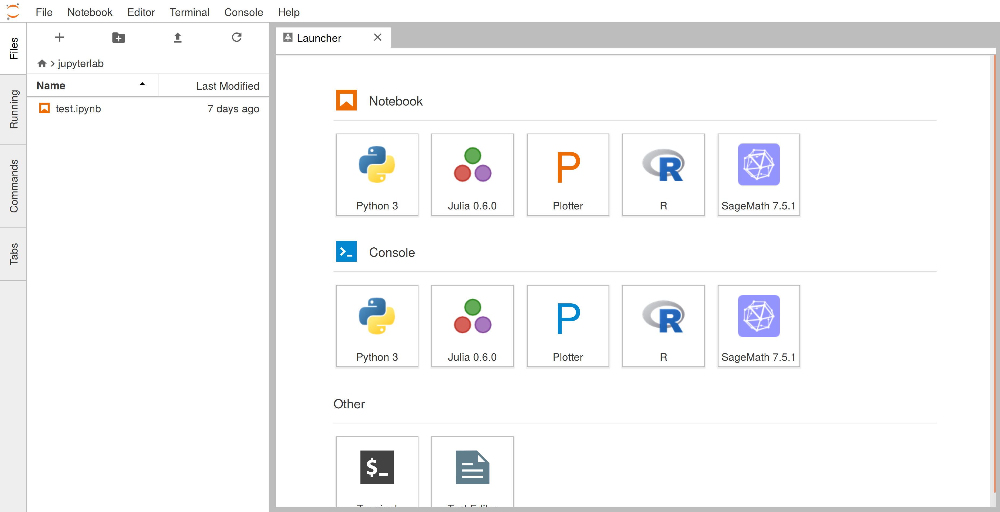

3. 在左侧面板上，我们还可以看到打开的选项卡列表、正在运行的会话列表或可用命令列表：

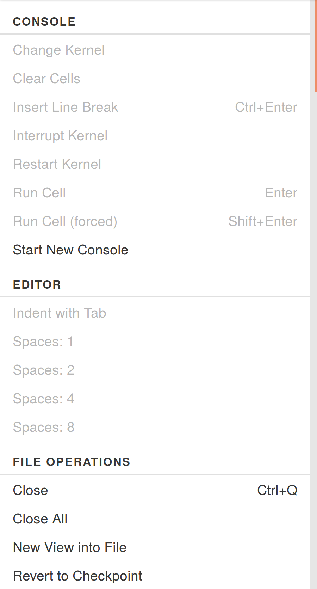

4. 如果我们打开一个Jupyter Notebook，我们会得到一个与经典NoteBook界面非常相似的界面:

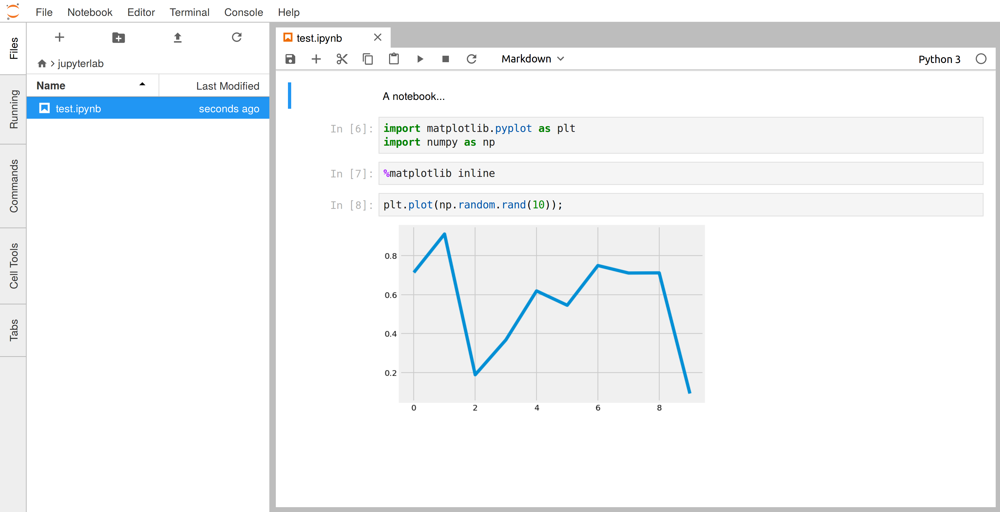

与经典的NoteBook相比，有一些改进。例如，我们可以拖放一个或几个单元格:

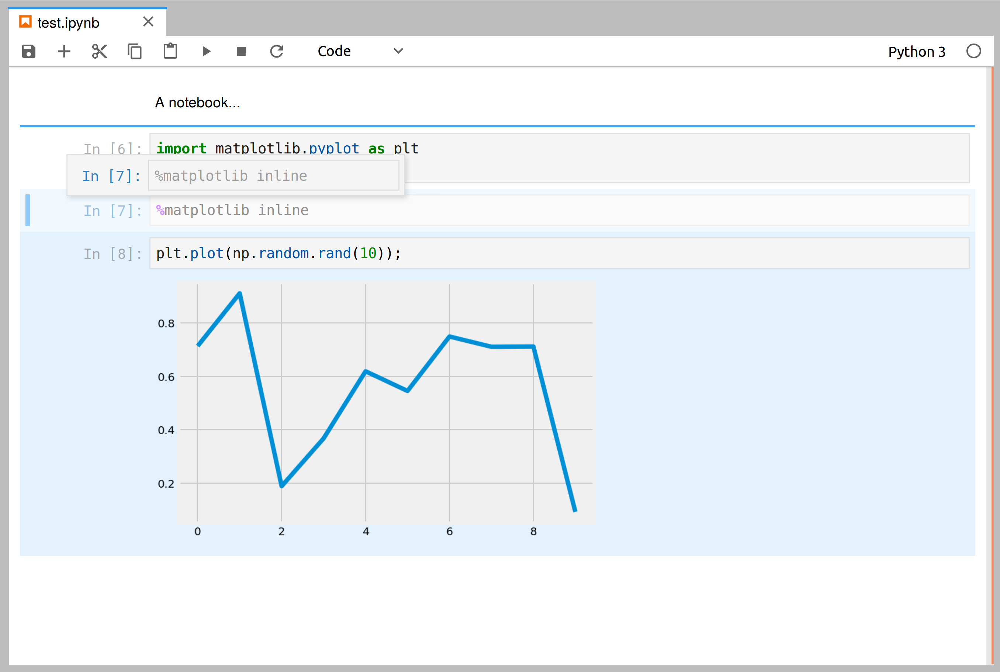

我们也可以折叠单元格。

5. 如果我们在NoteBook上右键单击，会出现一个上下文菜单:

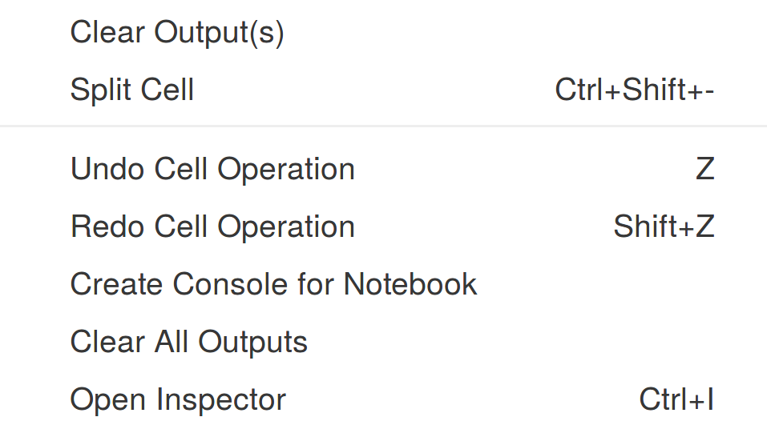

如果我们单击**Create Console for Notebook**，会出现一个带有标准IPython控制台的新选项卡。我们可以在屏幕的任何地方拖放标签，例如在NoteBook面板下面:

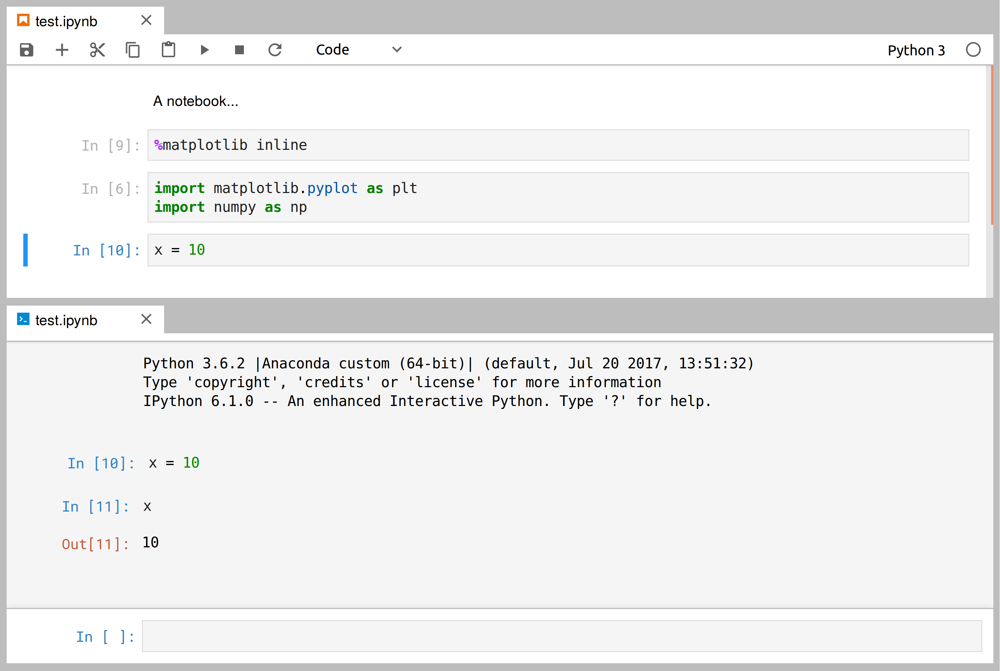

IPython控制台与NoteBook连接到同一个内核，因此它们共享相同的命名空间。我们还可以从启动程序中打开一个新的IPython控制台，在一个单独的内核中运行。

6. 我们还可以使用term.js库在浏览器中直接打开一个系统shell：

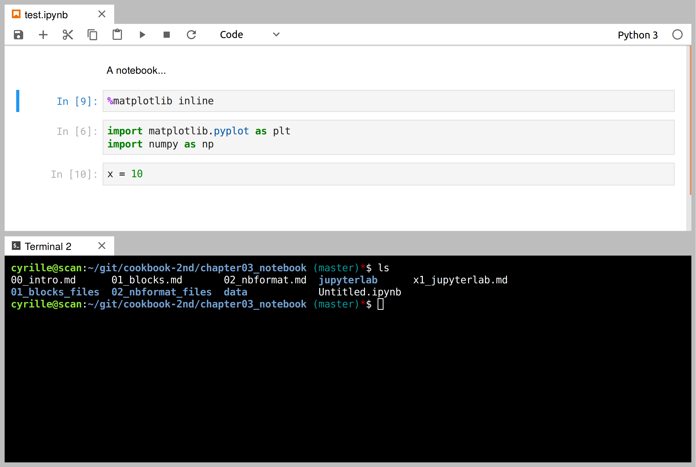

7. JupyterLab包括一个文本编辑器。我们可以从启动器中创建一个新的文本文件，通过设定`.md`扩展名，重命名并编辑它:

让我们右键单击Markdown文件。出现一个上下文菜单：

我们可以添加一个新的面板来实时呈现Markdown文件：

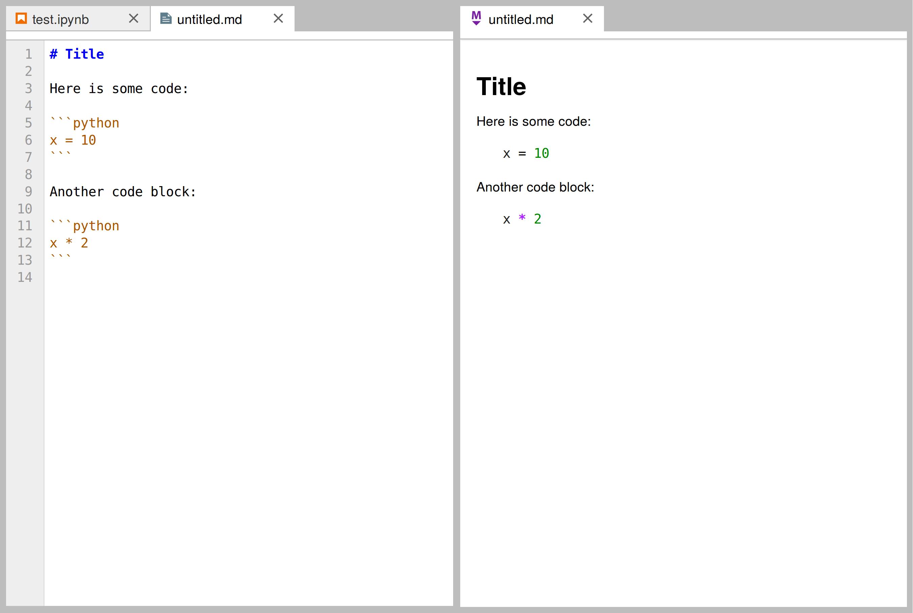

我们还可以将IPython控制台附加到Markdown文件。通过在代码块内单击并按**Shift Enter**，我们将代码直接发送到控制台：

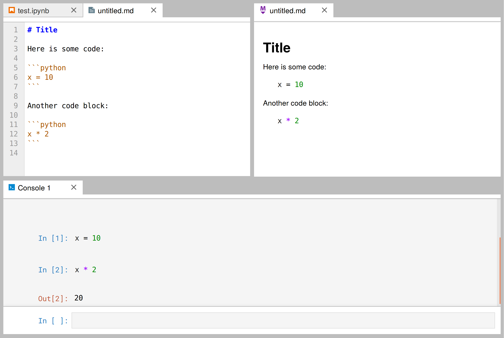

8. 我们还可以在JupyterLab中创建和打开CSV文件:

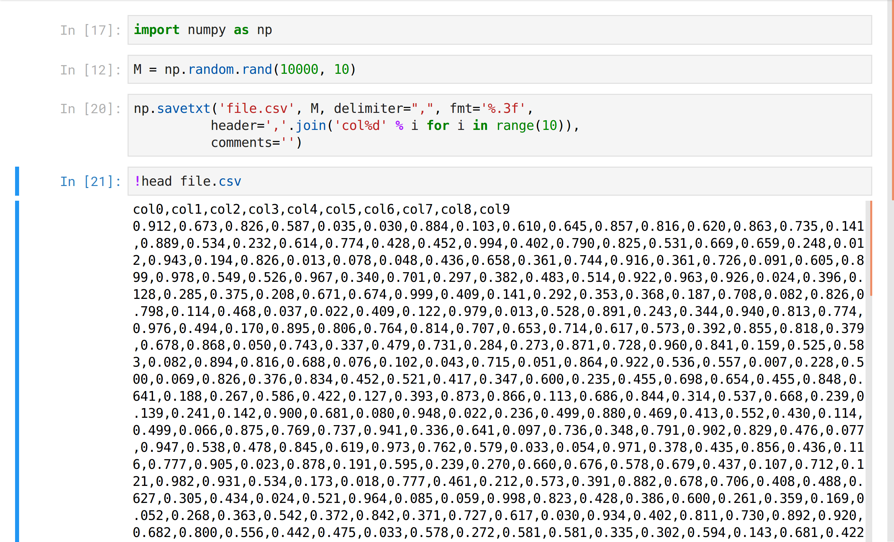

CSV查看器效率很高。它可以平滑地显示数百万甚至数十亿个值的巨大表：

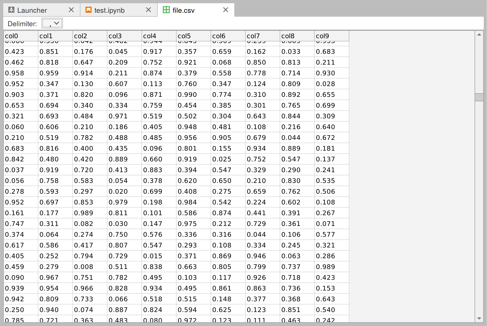

9. GeoJSON文件(包含地理信息的文件)也可以通过传单映射库进行编辑或查看:

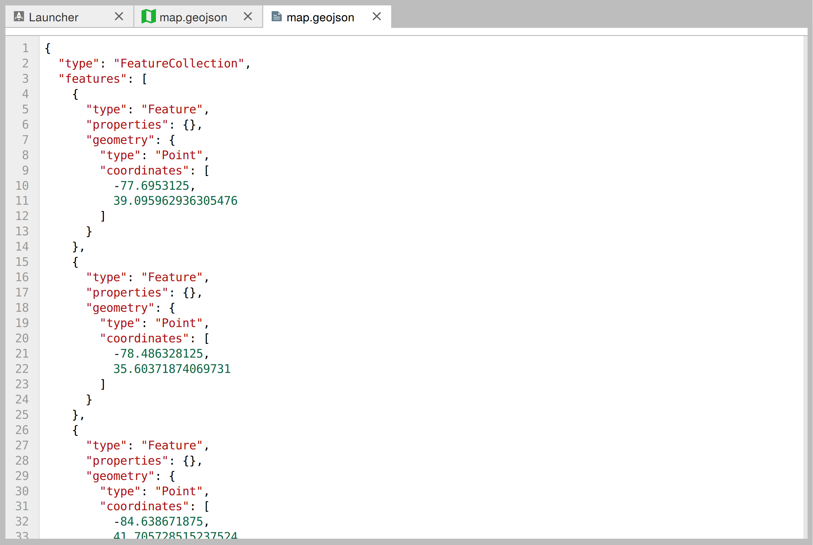
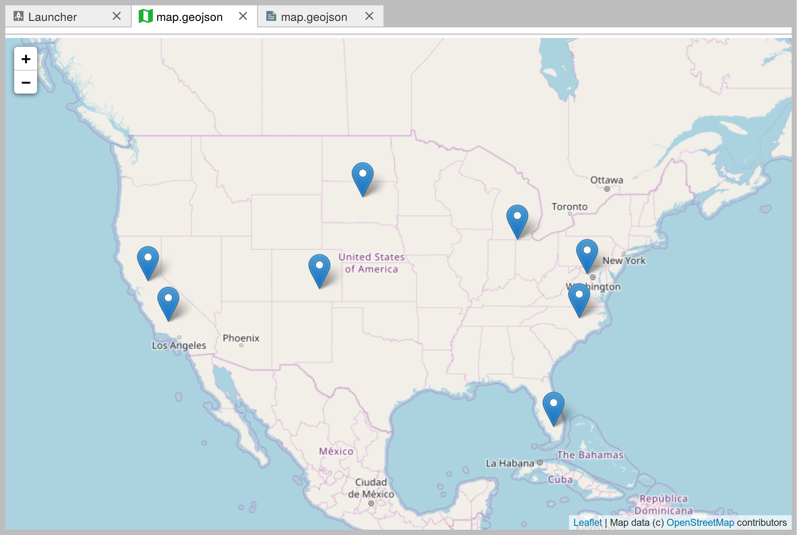

## 还有更多...

JupyterLab是完全可扩展的。事实上，所有现有的特性都是作为插件实现的。

可以在NoteBook上协同工作，比如使用GoogleDocs。在撰写本文时，这一特性仍在积极开发中。

以下是一些参考资料：

* JupyterLab GitHub project at https://github.com/jupyterlab/jupyterlab
* Jupyter renderers at https://github.com/jupyterlab/jupyter-renderers
* Talk at PyData 2017, available at https://channel9.msdn.com/Events/PyData/Seattle2017/BRK11
* Talk at PlotCON 2017, available at https://www.youtube.com/watch?v=p7Hr54VhOp0
* Talk at ESIP Tech, available at https://www.youtube.com/watch?v=K1AsGeak51A
* JupyterLab screencast at https://www.youtube.com/watch?v=sf8PuLcijuA
* Realtime collaboration and cloud storage for JupyterLab through Google Drive, at https://github.com/jupyterlab/jupyterlab-google-drive

## 另请参阅

* 介绍IPython和Jupyter Notebook
