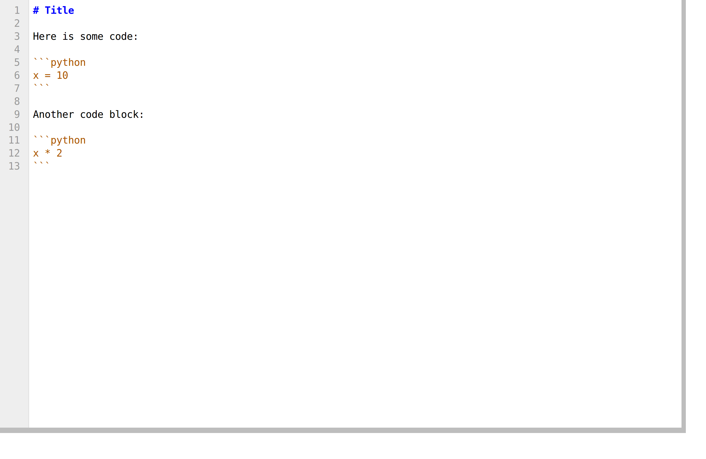

[*Chapter 3 : Mastering the Jupyter Notebook*](./)
[*第三章：掌握Jupyter Notebook*](./)

# 3.6. Introducing JupyterLab
# 3.6. 介绍JupyterLab

**JupyterLab** is the next generation of the Jupyter Notebook. It aims at fixing many usability issues of the Notebook, and it greatly expands its scope. JupyterLab offers a general framework for interactive computing and data science in the browser, using Python, Julia, R, or one of many other languages.
**JupyterLab**是Jupyter Notebook的下一代。它旨在修复NoteBook的许多可用性问题，并大大扩展了它的范围。JupyterLab提供了在浏览器中使用Python、Julia、R或其他许多语言之一的交互式计算和数据科学的通用框架。

In addition to providing an improved interface to existing notebooks, JupyterLab also brings within the same interface a file browser, consoles, terminals, text editors, Markdown editors, CSV editors, JSON editors, interactive maps, widgets, and so on. The architecture is completely extensible and open to developers. In a word, JupyterLab is a web-based, hackable IDE for data science and interactive computing.
除了为现有的NoteBook提供改进的接口之外，JupyterLab还在相同的接口中引入了文件浏览器、控制台、终端、文本编辑器、标记编辑器、CSV编辑器、JSON编辑器、交互式地图、小部件等等。体系结构是完全可扩展的，并且对开发人员开放。总之，JupyterLab是一个基于web的可编程IDE，用于数据科学和交互式计算。

JupyterLab uses the exact same Notebook server and file format as the classic Jupyter Notebook, so that it is fully compatible with the existing notebooks and kernels. The Classic Notebook and Jupyterlab can run side to side on the same computer. One can easily switch between the two interfaces.
JupyterLab使用与经典的Jupyter Notebook相同的NoteBook服务器和文件格式，因此它与现有的NoteBook和内核完全兼容。经典NoteBook和Jupyterlab可以在同一台电脑上并排运行。可以很容易地在两个接口之间切换。

> At the time of this writing, JupyterLab is still in an early stage of development. However, it is already fairly usable. The interface may change until the production release. The developer API used to customize JupyterLab is still not stable. There is no user documentation yet.
> 在撰写本文时，JupyterLab仍处于早期开发阶段。然而，它已经相当有用了。接口可能会更改，直到生产版本发布。用于定制JupyterLab的开发人员API仍然不稳定。目前还没有用户文档。

## Getting ready
## 准备工作

To install JupyterLab, type `conda install -c conda-forge jupyterlab` in a terminal.
在一个终端上安装JupyterLab，在终端键入`conda install -c conda-forge jupyterlab`

To be able to render GeoJSON files in an interactive map, install the GeoJSON JupyterLab extension with: `jupyter labextension install @jupyterlab/geojson-extension`.
要在交互式地图中渲染GeoJSON文件，请安装GeoJSON JupyterLab扩展:`jupyter labextension install @jupyterlab/geojson-extension`。

## How to do it...
## 怎么做...

1. We can launch JupyterLab by typing `jupyter lab` in a terminal. Then, we go to `http://localhost:8888/lab` in the web browser.
1. 我们可以通过在终端输入`jupyter lab`来启动JupyterLab。然后，在web浏览器中转到`http://localhost:8888/lab`。
2. The dashboard shows, on the left, a list of files and subdirectories in the current working directory. On the right, the launcher lets us create notebooks, text files, or open a Jupyter console or a terminal. Available Jupyter kernels are automatically displayed (here, IPython, but also IR and IJulia).
2. 左边的仪表板显示当前工作目录中的文件和子目录列表。在右边，启动器让我们创建NoteBook，文本文件，或打开Jupyter控制台或终端。自动显示可用的Jupyter内核(这里是IPython，还有IR和IJulia)。

3. On the left panel, we can also see the list of open tabs, the list of running sessions, or the list of available commands:
3. 在左侧面板上，我们还可以看到打开的选项卡列表、正在运行的会话列表或可用命令列表：

4. If we open a Jupyter notebook, we get an interface that closely resembles the classic Notebook interface:
4. 如果我们打开一个Jupyter Notebook，我们会得到一个与经典NoteBook界面非常相似的界面:

There are a few improvements compared to the classic Notebook. For example, we can drag and drop one or several cells:
与经典的NoteBook相比，有一些改进。例如，我们可以拖放一个或几个单元格:

We can also collapse cells.
我们也可以折叠单元格。

5. If we right-click in the notebook, a contextual menu appears:
5. 如果我们在NoteBook上右键单击，会出现一个上下文菜单:

If we click on *Create Console for Notebook*, a new tab appears with a standard IPython console. We can drag and drop the tab anywhere in the screen, for example below the notebook panel:
如果我们单击**Create Console for Notebook**，会出现一个带有标准IPython控制台的新选项卡。我们可以在屏幕的任何地方拖放标签，例如在NoteBook面板下面:

The IPython console is connected to the same kernel as the Notebook, so they share the same namespace. We can also open a new IPython console from the launcher, running in a separate kernel.
IPython控制台与NoteBook连接到同一个内核，因此它们共享相同的命名空间。我们还可以从启动程序中打开一个新的IPython控制台，在一个单独的内核中运行。

6. We can also open a system shell directly in the browser, using the term.js library:
6. 我们还可以使用term.js库在浏览器中直接打开一个系统shell：

7. JupyterLab includes a text editor. We can create a new text file from the launcher, rename it by giving it the `.md` extension, and edit it:
7. JupyterLab包括一个文本编辑器。我们可以从启动器中创建一个新的文本文件，通过设定`.md`扩展名，重命名并编辑它:

Let's right-click on the Markdown file. A contextual menu appears:
让我们右键单击Markdown文件。出现一个上下文菜单：

We can add a new panel that renders the Markdown file in real-time:
我们可以添加一个新的面板来实时呈现Markdown文件：

We can also attach an IPython console to our Markdown file. By clicking within a code block and pressing *Shift+Enter*, we send the code directly to the console:
我们还可以将IPython控制台附加到Markdown文件。通过在代码块内单击并按**Shift Enter**，我们将代码直接发送到控制台：

8. We can also create and open CSV files in JupyterLab:
8. 我们还可以在JupyterLab中创建和打开CSV文件:

The CSV viewer is highly efficient. It can smoothly display huge tables with millions or even billions of values:
CSV查看器效率很高。它可以平滑地显示数百万甚至数十亿个值的巨大表：

9. GeoJSON files (files that contain geographic information) can also be edited or viewed with the Leaflet mapping library:
9. GeoJSON文件(包含地理信息的文件)也可以通过传单映射库进行编辑或查看:

## There's more...
## 还有更多...

JupyterLab is fully extendable. In fact, the philosophy is that all existing features are implemented as plugins.
JupyterLab是完全可扩展的。事实上，所有现有的特性都是作为插件实现的。

It is possible to work collaboratively on a notebook, like with Google Docs. This feature is still in active development at the time of this writing.
可以在NoteBook上协同工作，比如使用GoogleDocs。在撰写本文时，这一特性仍在积极开发中。

Here are a few references:
以下是一些参考资料：

* JupyterLab GitHub project at https://github.com/jupyterlab/jupyterlab
* Jupyter renderers at https://github.com/jupyterlab/jupyter-renderers
* Talk at PyData 2017, available at https://channel9.msdn.com/Events/PyData/Seattle2017/BRK11
* Talk at PlotCON 2017, available at https://www.youtube.com/watch?v=p7Hr54VhOp0
* Talk at ESIP Tech, available at https://www.youtube.com/watch?v=K1AsGeak51A
* JupyterLab screencast at https://www.youtube.com/watch?v=sf8PuLcijuA
* Realtime collaboration and cloud storage for JupyterLab through Google Drive, at https://github.com/jupyterlab/jupyterlab-google-drive
* 通过GoogleDrive为Jupyter实验室提供实时协作和云存储， at https://github.com/jupyterlab/jupyterlab-google-drive

## See also
## 另请参阅

* Introducing IPython and the Jupyter Notebook
* 介绍IPython和Jupyter Notebook
